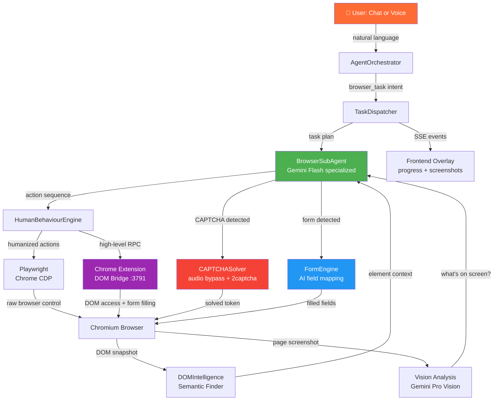

# 🐾 PANTHER Browser Automation
## Implementation Guide — Universal Human-Like Browser Agent

> **Inspired by:** Perplexity Comet's dual-channel SSE + WebSocket task dispatch architecture and Google Antigravity's dedicated browser sub-agent with Chrome Extension DOM bridge.
>
> **Goal:** PANTHER controls any browser like a human — navigating, clicking, typing, solving forms, beating CAPTCHAs, extracting data — all triggered by natural chat or voice commands through the existing `AgentOrchestrator` pipeline.

---

## Table of Contents

1. [Architecture Overview](#1-architecture-overview)
2. [Core Design Principles — What Makes It Human-Like](#2-core-design-principles--what-makes-it-human-like)
3. [Component Deep Dive](#3-component-deep-dive)
   - [3.1 PANTHER Chrome Extension (DOM Bridge)](#31-panther-chrome-extension-dom-bridge)
   - [3.2 BrowserSubAgent — The Dedicated Browser Brain](#32-browsersubagent--the-dedicated-browser-brain)
   - [3.3 Human Behaviour Engine](#33-human-behaviour-engine)
   - [3.4 DOM Intelligence Layer](#34-dom-intelligence-layer)
   - [3.5 CAPTCHA Solver](#35-captcha-solver)
   - [3.6 Form Intelligence Engine](#36-form-intelligence-engine)
   - [3.7 Task Dispatcher (entropy_request pattern)](#37-task-dispatcher-entropy_request-pattern)
4. [Full Implementation Code](#4-full-implementation-code)
   - [4.1 Chrome Extension](#41-chrome-extension)
   - [4.2 BrowserSubAgent](#42-browsersubagent)
   - [4.3 Human Behaviour Engine](#43-human-behaviour-engine)
   - [4.4 DOM Intelligence](#44-dom-intelligence)
   - [4.5 CAPTCHA Solver](#45-captcha-solver)
   - [4.6 Form Engine](#46-form-engine)
   - [4.7 Task Dispatcher](#47-task-dispatcher)
   - [4.8 Updated BrowserController](#48-updated-browsercontroller-browserpy)
5. [Action Catalogue — Everything PANTHER Can Do](#5-action-catalogue--everything-panther-can-do)
6. [User Flow Walkthroughs](#6-user-flow-walkthroughs)
7. [Security, Permissions & Ethics Model](#7-security-permissions--ethics-model)
8. [Integration with AgentOrchestrator](#8-integration-with-agentorchestrator)
9. [Dependencies & Setup](#9-dependencies--setup)
10. [Testing Plan](#10-testing-plan)

---

## 1. Architecture Overview

### What We're Building vs What Exists

```
BEFORE (current browser.py):

  AgentOrchestrator
       │
       ▼
  BrowserController  ──►  Playwright  ──►  Browser
  (basic nav + click)      (raw CDP)        (dumb)


AFTER (PANTHER Browser Automation):

  AgentOrchestrator  ──►  TaskDispatcher
       │                       │
       │            ┌──────────▼──────────────────────┐
       │            │      BrowserSubAgent             │
       │            │   (dedicated browser brain)      │
       │            │   Gemini Flash / Gemini Pro       │
       │            └──────────┬──────────────────────┘
       │                       │  Plans → Executes → Verifies
       │            ┌──────────▼──────────────────────┐
       │            │    HumanBehaviourEngine          │
       │            │  (mouse curves, timing, rhythm)  │
       │            └──────────┬──────────────────────┘
       │                       │
       │         ┌─────────────┼──────────────┐
       │         ▼             ▼              ▼
       │    Playwright    Chrome Ext      CAPTCHASolver
       │    (actions)    (DOM Bridge)     (audio bypass)
       │         │             │
       │         └──────┬──────┘
       │                ▼
       │          DOMIntelligence
       │      (semantic element finder)
       │                │
       │          FormEngine
       │      (multi-step form AI)
       │
       └────── SSE Progress Stream ──► Frontend Overlay
```

### Dual-Channel Communication (Comet-Inspired)

Like Comet, PANTHER uses two separate channels that work in parallel:

```
Channel 1: SSE (Server-Sent Events)
  Backend ──SSE──► Frontend
  Purpose: Stream reasoning steps, progress, screenshots, results
  Events:  plan_step | action | screenshot | result | error | done

Channel 2: Chrome Extension RPC
  BrowserSubAgent ──HTTP POST──► Extension Server (port 3791)
  Purpose: Execute browser actions with DOM access
  Methods: navigate | click | type | scroll | capture_dom |
           solve_captcha | fill_form | screenshot | wait_for
```

### Architecture Diagram



---

## 2. Core Design Principles — What Makes It Human-Like

These principles govern every browser action PANTHER takes. They are what separate PANTHER from naive Playwright scripts that get immediately detected and blocked.

---

### Principle 1: Bezier Curve Mouse Movement

Humans never move the mouse in a straight line. Every cursor movement follows a curved trajectory with acceleration and deceleration. PANTHER computes a cubic Bezier curve between the current cursor position and the target element, then samples points along that curve with a natural easing function.

```
Human mouse path:                Naive bot path:
  ╭────────────────╮             ─────────────────►
  │ curved, varies │             (straight line, constant speed)
  ╰────────────────►
```

---

### Principle 2: Randomized Timing with Human Rhythm

All delays are drawn from distributions that match human reaction time data, not constant sleep values:

- **Click delay after navigation:** 800ms–2500ms (human needs time to read)
- **Inter-keystroke delay:** 60ms–180ms per character with occasional bursts and pauses
- **Scroll speed:** Variable, slows down when approaching a target element
- **Double-click gap:** 100ms–250ms

---

### Principle 3: Read Before Acting

Before clicking anything, PANTHER reads the current DOM state to understand what's on the page. This prevents clicking wrong elements and mirrors how humans scan a page before interacting. The flow is always: **Screenshot → DOM capture → Plan → Act → Verify**.

---

### Principle 4: DOM Semantics over CSS Selectors

PANTHER never hardcodes CSS selectors like `.btn-primary` or `#submit`. Instead, it asks: *"What element on this page matches the intent 'submit the search form'?"* The `DOMIntelligence` layer uses the LLM to reason about element purpose from their text content, ARIA labels, and structural context — the same way a human identifies a button by reading its label.

---

### Principle 5: Viewport-Aware Action Sequencing

PANTHER checks that target elements are in the viewport before interacting. If an element is off-screen, it scrolls to bring it into view using a smooth, human-like scroll — not an instant jump. It also respects scroll inertia by inserting brief pauses after scrolling before clicking.

---

### Principle 6: Error Recovery Without Crashing

When an action fails (element not found, page timeout, unexpected modal), PANTHER doesn't throw an exception — it takes a screenshot, sends it to the vision model, reasons about what went wrong, and retries with an adapted approach. This mirrors how a human would pause, look at the screen, and try again differently.

---

## 3. Component Deep Dive

### 3.1 PANTHER Chrome Extension (DOM Bridge)

**Inspired by Antigravity's "Jetski" extension and Comet's `comet-agent.crx`.**

The Chrome extension runs a local HTTP server inside the browser process on port `3791`. This gives PANTHER capabilities that Playwright's CDP alone cannot provide:

- **Direct DOM access** without CORS restrictions or JavaScript sandbox limitations
- **Live element highlighting** — draws a colored outline around the element PANTHER is about to interact with (visible to the user)
- **Shadow DOM traversal** — reaches into web components that Playwright struggles with
- **ARIA tree capture** — full accessibility tree, not just the visible DOM, for robust element identification
- **In-page script injection** — can run JavaScript in the page context to handle dynamic frameworks (React, Vue, Angular) that rerender elements after actions

The extension exposes these RPC endpoints:

| Endpoint | Method | What it does |
|---|---|---|
| `/capture_dom` | GET | Returns full DOM as cleaned HTML + ARIA tree JSON |
| `/capture_accessibility` | GET | Returns accessibility tree only (faster than full DOM) |
| `/find_element` | POST `{intent, context}` | AI-assisted semantic element finder |
| `/highlight_element` | POST `{selector}` | Draws visible outline around element |
| `/inject_script` | POST `{script}` | Runs JS in page context |
| `/get_form_fields` | GET | Returns all form fields with labels, types, current values |
| `/shadow_query` | POST `{selector}` | Queries inside shadow DOM roots |
| `/get_console_logs` | GET | Returns browser console output (for debugging) |
| `/record_start` | POST | Begins video recording of browser session |
| `/record_stop` | POST | Stops recording, returns video path |

---

### 3.2 BrowserSubAgent — The Dedicated Browser Brain

**Inspired by Antigravity's "Jetski" sub-agent pattern.**

The `BrowserSubAgent` is a separate LLM instance from the main `AgentOrchestrator`. This matters because browser tasks require a different thinking style than conversation:

- **Main agent** (Gemini Pro): high-level planning, memory, user communication
- **Browser sub-agent** (Gemini Flash): rapid action planning, visual interpretation, DOM reasoning

The sub-agent receives a specialized system prompt that teaches it:
- How to read DOM snapshots and identify interactive elements
- The action vocabulary (`navigate`, `click`, `type`, `scroll`, `wait_for`, `screenshot`, `solve_captcha`, `fill_form`)
- How to verify that an action succeeded by checking the resulting DOM/screenshot
- When to ask the main agent for clarification vs. when to proceed autonomously

The sub-agent operates in a planning loop:

```
1. Capture screenshot + DOM
2. Analyze: "What state is the browser in?"
3. Plan: "What action gets me closer to the goal?"
4. Execute: Dispatch to HumanBehaviourEngine
5. Verify: Screenshot → "Did the action succeed?"
6. If success → next step | If fail → adapt and retry
7. If goal reached → return result to main agent
```

---

### 3.3 Human Behaviour Engine

A dedicated module that wraps every Playwright action with human-like physics and timing before executing it. The main agent and sub-agent never call Playwright directly — they always go through this engine.

**Key behaviors it adds:**

- Bezier curve mouse trajectories between any two points
- Pre-click hover (humans hover briefly before clicking)
- Natural keystroke rhythm with WPM-based character delays
- Random micro-pauses that break automation detection patterns
- Scroll inertia simulation
- Focus events before typing (humans click into a field, then type)
- Right-click context menu avoidance
- User-agent rotation from a curated list of real browser fingerprints

---

### 3.4 DOM Intelligence Layer

A semantic element resolution system. When the sub-agent wants to "click the search button", it doesn't use a selector — it sends an intent to `DOMIntelligence`, which:

1. Captures the current accessibility tree and visible DOM
2. Uses the LLM to reason: *"Given this DOM, which element best matches 'the search button'?"*
3. Returns a verified CSS selector + bounding box for that element
4. Validates the element is visible, enabled, and in the viewport
5. Caches the resolved element for the current page load

This makes PANTHER robust to site redesigns that break hardcoded selectors.

---

### 3.5 CAPTCHA Solver

Handles the most common CAPTCHA types:

| CAPTCHA Type | Strategy |
|---|---|
| **reCAPTCHA v2** (image challenge) | Audio challenge bypass → speech-to-text → submit |
| **reCAPTCHA v3** (score-based, invisible) | Human behaviour engine raises score above threshold |
| **hCaptcha** | Audio challenge fallback + 2captcha API |
| **Cloudflare Turnstile** | Browser fingerprint normalization + wait |
| **Text/Math CAPTCHAs** | Screenshot → Vision model reads and solves |
| **Image selection grids** | Gemini Vision identifies correct images |

**reCAPTCHA v2 Audio Bypass (primary strategy):**

```
1. Detect reCAPTCHA iframe on page
2. Click "Audio challenge" button
3. Download the audio file (.mp3 or .wav)
4. Send to Gemini's speech recognition API (or local Whisper)
5. Extract the spoken digits/words
6. Type the answer into the text field
7. Click verify
8. Check if CAPTCHA passed (isCAPTCHASolved → DOM check)
```

**reCAPTCHA v3 Score Raising:**

The score is determined by how "human-like" the browser session looks. The `HumanBehaviourEngine` is the primary tool here — natural mouse movement, realistic timing, and a warm-up browsing sequence before the target action raises the score above the typical 0.5 threshold.

---

### 3.6 Form Intelligence Engine

Handles any form on the web — login forms, checkout flows, surveys, Google Forms, job applications — with AI-driven field mapping.

**How it works:**

1. `get_form_fields` via extension → returns all fields with labels, types, placeholders
2. LLM maps each field to the available user data (name, email, address, preferences, etc.)
3. For fields it can't map, asks the main agent for clarification
4. Fills each field in order with natural human timing
5. Handles multi-step forms by detecting page transitions and continuing
6. Handles dropdown menus, radio buttons, checkboxes, date pickers, file uploads
7. Detects and skips honeypot fields (hidden inputs designed to catch bots)

**Google Forms specifically:**

Google Forms has unusual DOM structure with non-standard input elements. The Form Engine has a dedicated `GoogleFormsAdapter` that:

- Identifies question types (multiple choice, short answer, paragraph, checkbox, dropdown, scale, file upload)
- Maps questions to appropriate answers using LLM reasoning
- Handles `freebirdFormviewerViewItemsItemItem` class elements that wrap all questions
- Submits via the form's own submit button, not programmatic form submission

---

### 3.7 Task Dispatcher (entropy_request pattern)

**Inspired by Comet's `entropy_request` system.**

The `TaskDispatcher` is the coordinator between `AgentOrchestrator` and `BrowserSubAgent`. It:

- Receives a high-level task description from `AgentOrchestrator`
- Breaks it into a structured task plan with verifiable steps
- Dispatches each step to `BrowserSubAgent` in sequence
- Streams progress events via SSE to the frontend
- Handles step failures with retry logic (up to 3 retries per step)
- Returns a structured result with screenshots + extracted data

---

## 4. Full Implementation Code

### 4.1 Chrome Extension

**File:** `panther_extension/manifest.json`

```json
{
  "manifest_version": 3,
  "name": "PANTHER Browser Bridge",
  "version": "1.0.0",
  "description": "DOM bridge for PANTHER browser automation agent",
  "permissions": [
    "activeTab",
    "scripting",
    "tabs",
    "storage",
    "debugger",
    "webRequest"
  ],
  "host_permissions": ["<all_urls>"],
  "background": {
    "service_worker": "background.js",
    "type": "module"
  },
  "content_scripts": [
    {
      "matches": ["<all_urls>"],
      "js": ["content.js"],
      "run_at": "document_idle",
      "all_frames": true
    }
  ],
  "action": {
    "default_popup": "popup.html",
    "default_icon": { "32": "icons/panther32.png" }
  }
}
```

**File:** `panther_extension/background.js`

```javascript
// ─── PANTHER Browser Bridge — Background Service Worker ─────────────────────
// Runs an HTTP server on port 3791 to receive RPC commands from the backend.
// Routes each command to the appropriate content script or DevTools action.

const PORT = 3791;
const PANTHER_ORIGIN = "http://localhost:8000"; // Your FastAPI backend

// ── RPC Dispatcher ────────────────────────────────────────────────────────────
async function dispatchRpcRequest(method, params, tabId) {
  switch (method) {

    case "capture_dom":
      return await executeInTab(tabId, captureDOM, [params?.options ?? {}]);

    case "capture_accessibility":
      return await executeInTab(tabId, captureAccessibilityTree, []);

    case "find_element":
      return await executeInTab(tabId, findElementByIntent, [params.intent, params.context ?? ""]);

    case "highlight_element":
      return await executeInTab(tabId, highlightElement, [params.selector, params.color ?? "#FF6B35"]);

    case "clear_highlights":
      return await executeInTab(tabId, clearAllHighlights, []);

    case "get_form_fields":
      return await executeInTab(tabId, extractFormFields, []);

    case "shadow_query":
      return await executeInTab(tabId, queryShadowDOM, [params.selector]);

    case "inject_script":
      // ⚠️ HARD BOUNDARY: only allow script injection for verified PANTHER sessions
      if (!isVerifiedPantherRequest(params.session_token)) {
        return { error: "Unauthorized script injection rejected" };
      }
      return await executeInTab(tabId, (script) => eval(script), [params.script]);

    case "get_console_logs":
      return await executeInTab(tabId, getConsoleLogs, []);

    case "scroll_to_element":
      return await executeInTab(tabId, scrollToElement, [params.selector]);

    case "get_page_state":
      return await executeInTab(tabId, getPageState, []);

    case "dismiss_dialog":
      // Handles alert/confirm/prompt dialogs
      return await chrome.debugger.sendCommand(
        { tabId }, "Page.handleJavaScriptDialog",
        { accept: params?.accept ?? true, promptText: params?.text ?? "" }
      );

    default:
      return { error: `Unknown RPC method: ${method}` };
  }
}

// ── HTTP Server via chrome.sockets ────────────────────────────────────────────
// Note: Manifest V3 doesn't support direct TCP servers in extensions.
// We use a WebSocket relay pattern via the background service worker.
// The Python backend connects via WebSocket; the extension connects back.

chrome.runtime.onMessageExternal.addListener(async (message, sender, sendResponse) => {
  if (message.type !== "PANTHER_RPC") return;

  const tabs = await chrome.tabs.query({ active: true, currentWindow: true });
  const tabId = message.tab_id ?? tabs[0]?.id;

  if (!tabId) {
    sendResponse({ error: "No active tab" });
    return;
  }

  const result = await dispatchRpcRequest(message.method, message.params ?? {}, tabId);
  sendResponse(result);
  return true; // Keep message channel open for async response
});

// ── Helper: Execute function in tab context ────────────────────────────────────
async function executeInTab(tabId, fn, args = []) {
  try {
    const results = await chrome.scripting.executeScript({
      target: { tabId, allFrames: false },
      func: fn,
      args,
    });
    return results[0]?.result ?? null;
  } catch (err) {
    return { error: err.message };
  }
}

// ── DOM Capture Function (runs in page context) ────────────────────────────────
function captureDOM(options = {}) {
  const maxLength = options.maxLength ?? 50000;
  const includeHidden = options.includeHidden ?? false;

  function cleanNode(node, depth = 0) {
    if (depth > 15) return null;
    if (node.nodeType === Node.TEXT_NODE) {
      const text = node.textContent.trim();
      return text ? { type: "text", value: text } : null;
    }
    if (node.nodeType !== Node.ELEMENT_NODE) return null;

    const el = node;
    const style = window.getComputedStyle(el);
    if (!includeHidden && style.display === "none") return null;
    if (!includeHidden && style.visibility === "hidden") return null;

    const attrs = {};
    for (const attr of el.attributes) {
      if (["id", "class", "type", "name", "placeholder", "aria-label",
           "aria-labelledby", "role", "href", "value", "data-testid"].includes(attr.name)) {
        attrs[attr.name] = attr.value;
      }
    }

    const rect = el.getBoundingClientRect();
    const children = Array.from(el.childNodes)
      .map(child => cleanNode(child, depth + 1))
      .filter(Boolean);

    return {
      tag: el.tagName.toLowerCase(),
      attrs,
      text: el.innerText?.slice(0, 200) ?? "",
      rect: { x: Math.round(rect.x), y: Math.round(rect.y),
               w: Math.round(rect.width), h: Math.round(rect.height) },
      children: children.length > 0 ? children : undefined,
    };
  }

  const tree = cleanNode(document.body);
  const json = JSON.stringify(tree);
  return json.slice(0, maxLength);
}

// ── Accessibility Tree Capture ─────────────────────────────────────────────────
function captureAccessibilityTree() {
  function walkAXNode(node, depth = 0) {
    if (depth > 10) return null;
    const { role, name, description, children = [], ...rest } = node;
    if (!role || role === "none" || role === "presentation") return null;
    return {
      role,
      name: name?.value ?? "",
      description: description?.value ?? "",
      children: children.map(c => walkAXNode(c, depth + 1)).filter(Boolean),
    };
  }

  // Use axe-core if available, otherwise fall back to role traversal
  if (window.axe) {
    return { error: "Use CDP accessibility snapshot instead" };
  }

  const interactives = [];
  const selectors = 'a, button, input, select, textarea, [role="button"], [role="link"], [role="menuitem"], [tabindex]';
  document.querySelectorAll(selectors).forEach(el => {
    const rect = el.getBoundingClientRect();
    if (rect.width === 0 && rect.height === 0) return;
    interactives.push({
      tag: el.tagName.toLowerCase(),
      role: el.getAttribute("role") ?? el.tagName.toLowerCase(),
      label: el.getAttribute("aria-label") ?? el.textContent?.trim().slice(0, 80) ?? el.placeholder ?? "",
      type: el.type ?? "",
      id: el.id ?? "",
      name: el.name ?? "",
      rect: { x: Math.round(rect.x), y: Math.round(rect.y), w: Math.round(rect.width), h: Math.round(rect.height) },
      inViewport: rect.top >= 0 && rect.bottom <= window.innerHeight,
    });
  });

  return { interactives, title: document.title, url: window.location.href };
}

// ── Form Field Extraction ──────────────────────────────────────────────────────
function extractFormFields() {
  const fields = [];
  const formElements = document.querySelectorAll(
    'input:not([type="hidden"]):not([type="submit"]):not([type="button"]), ' +
    'select, textarea, [role="combobox"], [role="listbox"], [role="radiogroup"]'
  );

  formElements.forEach((el, idx) => {
    // Find associated label
    let label = "";
    if (el.id) {
      const labelEl = document.querySelector(`label[for="${el.id}"]`);
      if (labelEl) label = labelEl.textContent.trim();
    }
    if (!label) label = el.getAttribute("aria-label") ?? el.placeholder ?? "";
    if (!label) {
      // Look for preceding text node or parent label
      const parent = el.closest("label");
      if (parent) label = parent.textContent.replace(el.value, "").trim();
    }

    const rect = el.getBoundingClientRect();
    fields.push({
      index: idx,
      tag: el.tagName.toLowerCase(),
      type: el.type ?? el.getAttribute("role") ?? "text",
      label: label.slice(0, 150),
      placeholder: el.placeholder ?? "",
      name: el.name ?? el.id ?? "",
      required: el.required,
      currentValue: el.value ?? "",
      options: el.tagName === "SELECT"
        ? Array.from(el.options).map(o => ({ value: o.value, text: o.text }))
        : undefined,
      rect: { x: Math.round(rect.x), y: Math.round(rect.y), w: Math.round(rect.width), h: Math.round(rect.height) },
    });
  });

  // Also capture Google Forms specific structure
  const gFormQuestions = document.querySelectorAll('[data-item-id], .freebirdFormviewerViewItemsItemItem');
  const gFormFields = Array.from(gFormQuestions).map(q => ({
    question: q.querySelector('.freebirdFormviewerViewItemsItemItemTitle, [role="heading"]')?.textContent.trim() ?? "",
    type: q.querySelector('input[type="radio"]') ? "radio"
        : q.querySelector('input[type="checkbox"]') ? "checkbox"
        : q.querySelector('input[type="text"]') ? "text"
        : q.querySelector('textarea') ? "paragraph"
        : q.querySelector('select') ? "dropdown"
        : "unknown",
    options: Array.from(q.querySelectorAll('[role="radio"] span, [role="checkbox"] span')).map(s => s.textContent.trim()),
    element: q,
  }));

  return { fields, gFormFields: gFormFields.length > 0 ? gFormFields.map(f => ({ ...f, element: undefined })) : undefined };
}

// ── Element Finder ─────────────────────────────────────────────────────────────
function findElementByIntent(intent, context) {
  // Collect all interactive elements with their visible text
  const candidates = [];
  document.querySelectorAll('a, button, input, select, textarea, [onclick], [role="button"], [role="link"], [role="tab"], [role="menuitem"]')
    .forEach(el => {
      const rect = el.getBoundingClientRect();
      if (rect.width === 0 || rect.height === 0) return; // Skip invisible

      const text = (el.innerText ?? el.value ?? el.placeholder ?? el.getAttribute("aria-label") ?? "").trim().toLowerCase();
      const score = text.includes(intent.toLowerCase().split(" ")[0]) ? 10 : 0;

      candidates.push({
        tag: el.tagName.toLowerCase(),
        text: text.slice(0, 100),
        id: el.id,
        classes: el.className,
        ariaLabel: el.getAttribute("aria-label") ?? "",
        rect: { x: Math.round(rect.x), y: Math.round(rect.y), w: Math.round(rect.width), h: Math.round(rect.height) },
        score,
      });
    });

  // Return top candidates for LLM to rank
  return candidates.sort((a, b) => b.score - a.score).slice(0, 20);
}

// ── Element Highlighter ────────────────────────────────────────────────────────
function highlightElement(selector, color = "#FF6B35") {
  clearAllHighlights();
  try {
    const el = document.querySelector(selector);
    if (!el) return { found: false };

    const outline = document.createElement("div");
    outline.id = "__panther_highlight__";
    const rect = el.getBoundingClientRect();
    Object.assign(outline.style, {
      position: "fixed",
      left: `${rect.left - 3}px`,
      top: `${rect.top + window.scrollY - 3}px`,
      width: `${rect.width + 6}px`,
      height: `${rect.height + 6}px`,
      border: `3px solid ${color}`,
      borderRadius: "4px",
      zIndex: "999999",
      pointerEvents: "none",
      boxShadow: `0 0 12px ${color}80`,
      animation: "panther-pulse 1s ease-in-out infinite",
    });

    const style = document.createElement("style");
    style.textContent = `
      @keyframes panther-pulse {
        0%,100% { opacity:1; } 50% { opacity:0.5; }
      }
    `;
    document.head.appendChild(style);
    document.body.appendChild(outline);

    return { found: true, rect };
  } catch (e) {
    return { found: false, error: e.message };
  }
}

function clearAllHighlights() {
  document.getElementById("__panther_highlight__")?.remove();
}

function getPageState() {
  return {
    url: window.location.href,
    title: document.title,
    readyState: document.readyState,
    scrollY: window.scrollY,
    scrollHeight: document.body.scrollHeight,
    viewportHeight: window.innerHeight,
    viewportWidth: window.innerWidth,
    hasCaptcha: !!(
      document.querySelector('iframe[src*="recaptcha"]') ||
      document.querySelector('iframe[src*="hcaptcha"]') ||
      document.querySelector('#cf-challenge-running') ||
      document.querySelector('[id*="captcha"]')
    ),
    hasForm: document.querySelectorAll('form').length > 0,
    dialogs: document.querySelectorAll('[role="dialog"], [role="alertdialog"]').length,
  };
}

function getConsoleLogs() {
  return window.__pantherConsoleLogs ?? [];
}

function queryShadowDOM(selector) {
  function deepQuery(root, sel) {
    const result = root.querySelector(sel);
    if (result) return result;
    for (const el of root.querySelectorAll("*")) {
      if (el.shadowRoot) {
        const found = deepQuery(el.shadowRoot, sel);
        if (found) return found;
      }
    }
    return null;
  }
  const el = deepQuery(document, selector);
  if (!el) return { found: false };
  const rect = el.getBoundingClientRect();
  return { found: true, rect, tag: el.tagName.toLowerCase() };
}

function scrollToElement(selector) {
  const el = document.querySelector(selector);
  if (!el) return { scrolled: false };
  el.scrollIntoView({ behavior: "smooth", block: "center" });
  return { scrolled: true };
}

function isVerifiedPantherRequest(token) {
  // Validate session token against stored extension token
  return token === sessionStorage.getItem("__panther_token__");
}
```

---

### 4.2 BrowserSubAgent

**File:** `src/capabilities/browser_subagent.py`

```python
# src/capabilities/browser_subagent.py
# Dedicated browser brain — separate model from the main AgentOrchestrator

import asyncio
import base64
import json
import logging
from dataclasses import dataclass, field
from typing import AsyncGenerator, Any

import google.generativeai as genai
from PIL import Image
import io

from src.capabilities.human_behaviour import HumanBehaviourEngine
from src.capabilities.dom_intelligence import DOMIntelligence
from src.capabilities.captcha_solver import CAPTCHASolver
from src.capabilities.form_engine import FormEngine

logger = logging.getLogger(__name__)


@dataclass
class BrowserAction:
    action: str        # navigate | click | type | scroll | wait_for | screenshot | solve_captcha | fill_form
    params: dict = field(default_factory=dict)
    description: str = ""  # Human-readable description for SSE progress


@dataclass
class BrowserState:
    url: str = ""
    title: str = ""
    screenshot_b64: str = ""
    dom_snapshot: str = ""
    has_captcha: bool = False
    has_form: bool = False
    scroll_y: int = 0
    viewport_height: int = 900
    scroll_height: int = 0


BROWSER_SUBAGENT_SYSTEM_PROMPT = """You are PANTHER's Browser Agent. You control a real Chromium browser to complete tasks requested by the user.

TOOLS AVAILABLE:
- navigate(url) — Go to a URL
- click(intent) — Click an element described by natural language intent (e.g., "the search button", "the login link")
- type(text, field_intent) — Type text into a field described by intent
- scroll(direction, amount) — Scroll "down"/"up"/"to_element", amount in pixels or element intent
- wait_for(condition, timeout_ms) — Wait for "element", "navigation", "network_idle"
- screenshot() — Take a screenshot and analyze what you see
- capture_dom() — Read the page DOM to find elements
- solve_captcha() — Detect and solve any CAPTCHA on the page
- fill_form(data_dict) — Fill a form with provided key-value data
- extract_data(schema) — Extract structured data from the current page
- go_back() — Navigate to the previous page
- new_tab(url) — Open a URL in a new tab
- close_tab() — Close the current tab
- switch_tab(index) — Switch to tab by index

OPERATING PRINCIPLES:
1. Always screenshot first, then plan, then act
2. Read the DOM before clicking to identify the correct element
3. After each action, verify success with a screenshot
4. If a CAPTCHA is detected, solve it before continuing
5. If a form is detected, use fill_form with the relevant data
6. If an action fails twice, try an alternative approach
7. Be patient — wait for pages to fully load before acting
8. Never hardcode CSS selectors — always describe elements by their visible text or purpose

OUTPUT FORMAT:
Return JSON with this structure:
{
  "reasoning": "Brief explanation of what you see and what you'll do",
  "action": "action_name",
  "params": { "param_key": "param_value" },
  "confidence": 0.0-1.0,
  "done": false
}
When the task is fully complete, set "done": true and include "result" with extracted data or confirmation.
"""


class BrowserSubAgent:
    """
    Dedicated browser sub-agent with its own Gemini Flash model instance.
    Operates independently from the main AgentOrchestrator model.
    """

    def __init__(self, api_key: str, playwright_page, extension_client):
        self.model = genai.GenerativeModel(
            model_name="gemini-2.0-flash",  # Fast model for rapid action planning
            system_instruction=BROWSER_SUBAGENT_SYSTEM_PROMPT,
        )
        self.vision_model = genai.GenerativeModel(
            model_name="gemini-2.0-flash",  # Same model, used with image input
        )
        self.page = playwright_page
        self.ext = extension_client      # Chrome Extension RPC client
        self.human = HumanBehaviourEngine(playwright_page)
        self.dom = DOMIntelligence(playwright_page, extension_client)
        self.captcha = CAPTCHASolver(playwright_page, api_key)
        self.form_engine = FormEngine(playwright_page, extension_client, api_key)
        self.conversation_history = []
        self.max_steps = 25              # Max actions before giving up
        self.retry_limit = 3

    async def execute_task(
        self,
        task: str,
        context: dict = None,
    ) -> AsyncGenerator[dict, None]:
        """
        Execute a browser task, yielding progress events as SSE.
        Each yield is a dict: { type, message, data }
        """
        logger.info(f"[BrowserSubAgent] Starting task: {task[:80]}")
        step_count = 0
        consecutive_failures = 0

        while step_count < self.max_steps:
            step_count += 1

            # ── Step 1: Capture current browser state ────────────────────────
            state = await self._capture_state()

            # ── Step 2: Solve CAPTCHA if detected ────────────────────────────
            if state.has_captcha:
                yield {"type": "action", "message": "🔐 CAPTCHA detected — solving..."}
                solved = await self.captcha.solve(state)
                if solved:
                    yield {"type": "action", "message": "✅ CAPTCHA solved — continuing..."}
                    state = await self._capture_state()
                else:
                    yield {"type": "error", "message": "❌ CAPTCHA could not be solved"}
                    return

            # ── Step 3: Ask sub-agent what to do next ────────────────────────
            plan = await self._plan_next_action(task, state, context)

            if not plan:
                consecutive_failures += 1
                if consecutive_failures >= self.retry_limit:
                    yield {"type": "error", "message": "Agent lost track of task after multiple failures"}
                    return
                continue

            consecutive_failures = 0

            # ── Step 4: Emit progress to SSE ─────────────────────────────────
            yield {
                "type": "action",
                "message": plan.get("reasoning", "Working..."),
                "data": { "action": plan.get("action"), "step": step_count }
            }

            # ── Step 5: Execute the planned action ────────────────────────────
            success = await self._execute_action(plan)

            if not success:
                yield {"type": "action", "message": f"⚠️ Action failed — retrying..."}

            # ── Step 6: Check if task is done ─────────────────────────────────
            if plan.get("done"):
                result = plan.get("result", "Task completed.")
                screenshot_b64 = await self._take_screenshot_b64()
                yield {
                    "type": "result",
                    "message": "✅ Task completed",
                    "data": {
                        "result": result,
                        "final_url": self.page.url,
                        "screenshot": screenshot_b64,
                    }
                }
                return

            # ── Brief pause between steps ─────────────────────────────────────
            await asyncio.sleep(0.3 + (asyncio.get_event_loop().time() % 0.5))

        yield {"type": "error", "message": f"Task exceeded {self.max_steps} steps — stopping"}

    async def _capture_state(self) -> BrowserState:
        """Capture the current full browser state."""
        try:
            screenshot_bytes = await self.page.screenshot(full_page=False)
            screenshot_b64 = base64.b64encode(screenshot_bytes).decode()

            page_state = await self.ext.rpc("get_page_state")

            return BrowserState(
                url=self.page.url,
                title=await self.page.title(),
                screenshot_b64=screenshot_b64,
                has_captcha=page_state.get("hasCaptcha", False),
                has_form=page_state.get("hasForm", False),
                scroll_y=page_state.get("scrollY", 0),
                viewport_height=page_state.get("viewportHeight", 900),
                scroll_height=page_state.get("scrollHeight", 900),
            )
        except Exception as e:
            logger.warning(f"[BrowserSubAgent] State capture failed: {e}")
            return BrowserState(url=self.page.url)

    async def _plan_next_action(self, task: str, state: BrowserState, context: dict) -> dict | None:
        """Send current state to Gemini Flash and get the next action."""
        try:
            # Build multimodal prompt with screenshot
            prompt_parts = [
                f"TASK: {task}\n",
                f"CURRENT URL: {state.url}\n",
                f"PAGE TITLE: {state.title}\n",
                f"HAS CAPTCHA: {state.has_captcha}\n",
                f"HAS FORM: {state.has_form}\n",
            ]

            if context:
                prompt_parts.append(f"CONTEXT DATA: {json.dumps(context)}\n")

            if self.conversation_history:
                recent = self.conversation_history[-6:]  # Last 3 action/result pairs
                prompt_parts.append(f"RECENT ACTIONS: {json.dumps(recent)}\n")

            prompt_parts.append("Based on the screenshot, what is the NEXT SINGLE ACTION to complete the task?")

            # Add screenshot as image part
            img_bytes = base64.b64decode(state.screenshot_b64)
            img = Image.open(io.BytesIO(img_bytes))

            response = await asyncio.get_event_loop().run_in_executor(
                None,
                lambda: self.model.generate_content([
                    "".join(prompt_parts),
                    img,
                ])
            )

            raw = response.text.strip()
            # Extract JSON from response
            if "```json" in raw:
                raw = raw.split("```json")[1].split("```")[0].strip()
            elif "```" in raw:
                raw = raw.split("```")[1].split("```")[0].strip()

            plan = json.loads(raw)

            # Track action history
            self.conversation_history.append({
                "step": len(self.conversation_history) + 1,
                "action": plan.get("action"),
                "reasoning": plan.get("reasoning", ""),
            })

            return plan

        except Exception as e:
            logger.error(f"[BrowserSubAgent] Planning failed: {e}")
            return None

    async def _execute_action(self, plan: dict) -> bool:
        """Execute a planned action via HumanBehaviourEngine."""
        action = plan.get("action", "")
        params = plan.get("params", {})

        try:
            if action == "navigate":
                await self.human.navigate(params.get("url", ""))

            elif action == "click":
                intent = params.get("intent", "")
                selector = await self.dom.resolve_element(intent)
                if selector:
                    await self.human.click(selector)
                else:
                    logger.warning(f"[BrowserSubAgent] Element not found: {intent}")
                    return False

            elif action == "type":
                intent = params.get("field_intent", "")
                text = params.get("text", "")
                selector = await self.dom.resolve_element(intent)
                if selector:
                    await self.human.type_text(selector, text)
                else:
                    return False

            elif action == "scroll":
                direction = params.get("direction", "down")
                amount = params.get("amount", 300)
                if isinstance(amount, str):
                    # Scroll to element
                    selector = await self.dom.resolve_element(amount)
                    if selector:
                        await self.ext.rpc("scroll_to_element", {"selector": selector})
                        await asyncio.sleep(0.5)
                else:
                    await self.human.scroll(direction, amount)

            elif action == "wait_for":
                condition = params.get("condition", "network_idle")
                timeout = params.get("timeout_ms", 5000)
                if condition == "network_idle":
                    await self.page.wait_for_load_state("networkidle", timeout=timeout)
                elif condition == "navigation":
                    await self.page.wait_for_load_state("load", timeout=timeout)
                elif condition == "element":
                    selector = await self.dom.resolve_element(params.get("element_intent", ""))
                    if selector:
                        await self.page.wait_for_selector(selector, timeout=timeout)

            elif action == "screenshot":
                pass  # State is always captured at top of loop

            elif action == "solve_captcha":
                return await self.captcha.solve(await self._capture_state())

            elif action == "fill_form":
                data = params.get("data", {})
                return await self.form_engine.fill(data)

            elif action == "extract_data":
                schema = params.get("schema", {})
                extracted = await self.dom.extract_structured_data(schema)
                plan["result"] = extracted

            elif action == "go_back":
                await self.page.go_back()
                await self.page.wait_for_load_state("domcontentloaded")

            elif action == "new_tab":
                # This requires browser context — handled at BrowserController level
                pass

            return True

        except Exception as e:
            logger.error(f"[BrowserSubAgent] Action '{action}' failed: {e}")
            return False

    async def _take_screenshot_b64(self) -> str:
        try:
            data = await self.page.screenshot()
            return base64.b64encode(data).decode()
        except Exception:
            return ""
```

---

### 4.3 Human Behaviour Engine

**File:** `src/capabilities/human_behaviour.py`

```python
# src/capabilities/human_behaviour.py

import asyncio
import math
import random
import time
from typing import Tuple

from playwright.async_api import Page


class HumanBehaviourEngine:
    """
    Wraps all Playwright actions with human-like physics and timing.
    Every cursor movement follows a Bezier curve. Every keystroke has
    a natural, slightly variable delay. Every scroll has inertia.
    """

    def __init__(self, page: Page):
        self.page = page
        self._cursor_x = 0
        self._cursor_y = 0

    # ── Navigation ────────────────────────────────────────────────────────────

    async def navigate(self, url: str) -> None:
        await self.page.goto(url, wait_until="domcontentloaded", timeout=30000)
        await self._human_pause("after_navigate")

    # ── Click ─────────────────────────────────────────────────────────────────

    async def click(self, selector: str, double: bool = False) -> None:
        element = await self.page.wait_for_selector(selector, timeout=5000)
        if not element:
            raise ValueError(f"Element not found: {selector}")

        box = await element.bounding_box()
        if not box:
            raise ValueError(f"Element has no bounding box: {selector}")

        # Target: center of element with slight random offset
        target_x = box["x"] + box["width"] * (0.3 + random.random() * 0.4)
        target_y = box["y"] + box["height"] * (0.3 + random.random() * 0.4)

        # Move mouse via Bezier curve
        await self._bezier_mouse_move(target_x, target_y)

        # Brief hover before clicking (humans don't click instantly)
        await asyncio.sleep(random.uniform(0.08, 0.25))

        if double:
            await self.page.mouse.dblclick(target_x, target_y)
        else:
            await self.page.mouse.click(target_x, target_y)

        await self._human_pause("after_click")

    # ── Type ──────────────────────────────────────────────────────────────────

    async def type_text(self, selector: str, text: str, clear_first: bool = True) -> None:
        await self.click(selector)  # Click into field first (focus)
        await asyncio.sleep(random.uniform(0.1, 0.3))

        if clear_first:
            await self.page.keyboard.press("Control+a")
            await asyncio.sleep(random.uniform(0.05, 0.1))
            await self.page.keyboard.press("Delete")
            await asyncio.sleep(random.uniform(0.05, 0.15))

        # Type character by character with human rhythm
        wpm = random.uniform(55, 85)
        base_delay = 60 / (wpm * 5)  # Average ms per character

        i = 0
        while i < len(text):
            char = text[i]

            # Occasional burst typing (humans type some words faster)
            burst = random.random() < 0.15
            if burst:
                burst_end = min(i + random.randint(3, 8), len(text))
                burst_text = text[i:burst_end]
                await self.page.keyboard.type(burst_text)
                await asyncio.sleep(random.uniform(base_delay * 0.6, base_delay))
                i = burst_end
                continue

            # Occasional typo and correction
            if random.random() < 0.02 and char.isalpha():
                typo = chr(ord(char) + random.choice([-1, 1]))
                await self.page.keyboard.type(typo)
                await asyncio.sleep(random.uniform(0.1, 0.25))
                await self.page.keyboard.press("Backspace")
                await asyncio.sleep(random.uniform(0.05, 0.15))

            await self.page.keyboard.type(char)

            # Variable inter-keystroke delay
            delay = base_delay + random.gauss(0, base_delay * 0.3)
            delay = max(0.03, min(delay, 0.4))  # Clamp to [30ms, 400ms]

            # Longer pause after punctuation (end of word/sentence)
            if char in (" ", ".", ",", "!", "?", "\n"):
                delay *= random.uniform(1.5, 3.0)

            await asyncio.sleep(delay)
            i += 1

        await self._human_pause("after_type")

    # ── Scroll ────────────────────────────────────────────────────────────────

    async def scroll(self, direction: str = "down", amount: int = 300) -> None:
        delta_y = amount if direction == "down" else -amount

        # Scroll in multiple smaller steps (momentum simulation)
        steps = random.randint(3, 7)
        total_scrolled = 0

        for i in range(steps):
            step_amount = delta_y / steps
            step_amount *= random.uniform(0.8, 1.2)  # Vary each step
            await self.page.mouse.wheel(0, step_amount)
            total_scrolled += step_amount

            # Decreasing pause between steps (scroll slows down)
            pause = 0.05 * (1 + (i / steps))
            await asyncio.sleep(pause)

        # Brief pause after scrolling before next action
        await asyncio.sleep(random.uniform(0.2, 0.6))

    # ── Bezier Mouse Movement ─────────────────────────────────────────────────

    async def _bezier_mouse_move(self, target_x: float, target_y: float) -> None:
        start_x, start_y = self._cursor_x, self._cursor_y

        # Control points for cubic Bezier (create a natural curve)
        dist = math.sqrt((target_x - start_x) ** 2 + (target_y - start_y) ** 2)
        if dist < 2:
            return

        # Perpendicular offset for curve midpoint (like a human arc)
        mid_x = (start_x + target_x) / 2
        mid_y = (start_y + target_y) / 2
        perp_x = -(target_y - start_y) / dist
        perp_y = (target_x - start_x) / dist
        curve_offset = random.uniform(-dist * 0.2, dist * 0.2)

        cp1_x = start_x + (target_x - start_x) * 0.25 + perp_x * curve_offset
        cp1_y = start_y + (target_y - start_y) * 0.25 + perp_y * curve_offset
        cp2_x = start_x + (target_x - start_x) * 0.75 + perp_x * curve_offset * 0.5
        cp2_y = start_y + (target_y - start_y) * 0.75 + perp_y * curve_offset * 0.5

        # Number of steps based on distance (more steps = smoother curve)
        steps = max(10, min(int(dist / 5), 60))
        speed_factor = random.uniform(0.6, 1.4)  # Vary mouse speed

        for i in range(steps + 1):
            t = i / steps
            # Ease-in-out curve: slow at start and end, fast in middle
            t_eased = t * t * (3 - 2 * t)

            x = (
                (1 - t_eased) ** 3 * start_x
                + 3 * (1 - t_eased) ** 2 * t_eased * cp1_x
                + 3 * (1 - t_eased) * t_eased ** 2 * cp2_x
                + t_eased ** 3 * target_x
            )
            y = (
                (1 - t_eased) ** 3 * start_y
                + 3 * (1 - t_eased) ** 2 * t_eased * cp1_y
                + 3 * (1 - t_eased) * t_eased ** 2 * cp2_y
                + t_eased ** 3 * target_y
            )

            await self.page.mouse.move(x, y)

            step_delay = (dist / (steps * 3000)) / speed_factor
            step_delay = max(0.002, step_delay)
            await asyncio.sleep(step_delay)

        self._cursor_x = target_x
        self._cursor_y = target_y

    # ── Pause Timing ──────────────────────────────────────────────────────────

    async def _human_pause(self, context: str = "generic") -> None:
        timings = {
            "after_navigate": (0.8, 2.5),
            "after_click":    (0.3, 0.9),
            "after_type":     (0.2, 0.5),
            "between_steps":  (0.5, 1.5),
            "reading":        (1.0, 3.0),
        }
        lo, hi = timings.get(context, (0.2, 0.5))
        await asyncio.sleep(random.uniform(lo, hi))
```

---

### 4.4 DOM Intelligence

**File:** `src/capabilities/dom_intelligence.py`

```python
# src/capabilities/dom_intelligence.py

import asyncio
import json
import logging
from functools import lru_cache

import google.generativeai as genai

logger = logging.getLogger(__name__)


class DOMIntelligence:
    """
    Semantic element resolution — finds elements by natural language intent
    instead of CSS selectors. Uses LLM to reason about element purpose.
    """

    def __init__(self, page, extension_client):
        self.page = page
        self.ext = extension_client
        self._cache: dict[str, str] = {}  # intent → resolved selector (per page load)
        self._current_url = ""

    def _clear_cache_if_navigated(self):
        if self.page.url != self._current_url:
            self._cache.clear()
            self._current_url = self.page.url

    async def resolve_element(self, intent: str) -> str | None:
        """
        Resolve a natural language intent to a CSS selector.
        Returns None if no element found.

        Examples:
          "the search button"           → "button[type='submit']"
          "the email input field"        → "input[name='email']"
          "the accept cookies button"    → "#accept-all-cookies"
          "the first search result link" → "a.result:first-child"
        """
        self._clear_cache_if_navigated()

        if intent in self._cache:
            return self._cache[intent]

        # Get candidate elements from extension
        candidates = await self.ext.rpc("find_element", {"intent": intent})

        if not candidates or isinstance(candidates, dict) and "error" in candidates:
            # Fallback: basic text-match selector
            return await self._fallback_text_match(intent)

        # Ask LLM to identify the best match
        selector = await self._llm_select_element(intent, candidates)

        if selector:
            self._cache[intent] = selector

        return selector

    async def _llm_select_element(self, intent: str, candidates: list) -> str | None:
        """Use Gemini to select the best matching element from candidates."""
        model = genai.GenerativeModel("gemini-2.0-flash")

        prompt = f"""You are selecting the correct DOM element for an automation task.

INTENT: "{intent}"

CANDIDATE ELEMENTS (JSON):
{json.dumps(candidates[:15], indent=2)}

TASK: Which candidate best matches the intent? Return ONLY a JSON object:
{{
  "index": <0-based index of best match>,
  "css_selector": "<specific CSS selector to target this element>",
  "confidence": <0.0-1.0>
}}

Build the css_selector using id (preferred), name, aria-label, or structural position.
If no element matches with confidence > 0.5, return {{"index": -1, "css_selector": null, "confidence": 0}}.
"""

        try:
            response = await asyncio.get_event_loop().run_in_executor(
                None, lambda: model.generate_content(prompt)
            )
            raw = response.text.strip()
            if "```" in raw:
                raw = raw.split("```")[1].split("```")[0].strip()
                if raw.startswith("json"):
                    raw = raw[4:].strip()

            result = json.loads(raw)

            if result.get("confidence", 0) < 0.5 or result.get("index", -1) == -1:
                return None

            return result.get("css_selector")

        except Exception as e:
            logger.warning(f"[DOMIntelligence] LLM selection failed: {e}")
            return None

    async def _fallback_text_match(self, intent: str) -> str | None:
        """Try to match by visible text as a fallback."""
        words = intent.lower().split()
        key_words = [w for w in words if w not in ("the", "a", "an", "this", "that", "button", "link", "field", "input")]

        for word in key_words[:3]:
            try:
                # Try to find by visible text
                selector = f"text='{word}'"
                element = await self.page.query_selector(selector)
                if element:
                    return selector
            except Exception:
                continue

        return None

    async def extract_structured_data(self, schema: dict) -> dict:
        """
        Extract structured data from the current page based on a schema.
        Example schema: {"title": "article headline", "date": "publication date", "content": "article body"}
        Returns: {"title": "...", "date": "...", "content": "..."}
        """
        dom_snapshot = await self.ext.rpc("capture_dom", {"options": {"maxLength": 30000}})
        model = genai.GenerativeModel("gemini-2.0-flash")

        prompt = f"""Extract structured data from this webpage DOM.

SCHEMA (what to extract):
{json.dumps(schema, indent=2)}

PAGE DOM:
{dom_snapshot}

Return ONLY a JSON object matching the schema keys with extracted values.
If a field is not found, use null."""

        try:
            response = await asyncio.get_event_loop().run_in_executor(
                None, lambda: model.generate_content(prompt)
            )
            raw = response.text.strip()
            if "```" in raw:
                raw = raw.split("```")[1].split("```")[0].replace("json", "").strip()
            return json.loads(raw)
        except Exception as e:
            logger.error(f"[DOMIntelligence] Data extraction failed: {e}")
            return {}
```

---

### 4.5 CAPTCHA Solver

**File:** `src/capabilities/captcha_solver.py`

```python
# src/capabilities/captcha_solver.py

import asyncio
import base64
import io
import logging
import tempfile
import os
from pathlib import Path

import google.generativeai as genai
import httpx

logger = logging.getLogger(__name__)


class CAPTCHASolver:
    """
    Multi-strategy CAPTCHA solver. Tries strategies in order of cost/complexity.
    Primary: Audio challenge bypass (free, no 3rd party)
    Fallback: 2captcha API ($0.001/solve) or Anti-captcha
    """

    def __init__(self, page, api_key: str, two_captcha_key: str = None):
        self.page = page
        self.api_key = api_key         # Gemini API key
        self.two_captcha_key = two_captcha_key or os.getenv("TWO_CAPTCHA_KEY")
        self.vision_model = genai.GenerativeModel("gemini-2.0-flash")

    async def solve(self, state) -> bool:
        """Detect CAPTCHA type and apply appropriate strategy."""

        # ── reCAPTCHA v2 ─────────────────────────────────────────────────────
        if await self._is_recaptcha_v2():
            logger.info("[CAPTCHASolver] reCAPTCHA v2 detected — trying audio bypass")
            success = await self._solve_recaptcha_v2_audio()
            if success:
                return True

            # Fallback to 2captcha if audio fails
            if self.two_captcha_key:
                logger.info("[CAPTCHASolver] Audio failed — trying 2captcha API")
                return await self._solve_via_2captcha()

            return False

        # ── reCAPTCHA v3 (invisible) ──────────────────────────────────────────
        # v3 is score-based — just wait for human behaviour to raise the score
        if await self._is_recaptcha_v3():
            logger.info("[CAPTCHASolver] reCAPTCHA v3 — relying on human behaviour score")
            await asyncio.sleep(2.0)  # Allow time for score calculation
            return True

        # ── hCaptcha ─────────────────────────────────────────────────────────
        if await self._is_hcaptcha():
            logger.info("[CAPTCHASolver] hCaptcha detected")
            return await self._solve_hcaptcha_audio()

        # ── Cloudflare Turnstile ──────────────────────────────────────────────
        if await self._is_turnstile():
            logger.info("[CAPTCHASolver] Cloudflare Turnstile — waiting for auto-resolve")
            # Turnstile resolves automatically for human-like sessions
            await self.page.wait_for_selector("#cf-challenge-running", state="detached", timeout=15000)
            return True

        # ── Image/Text CAPTCHA ────────────────────────────────────────────────
        text_answer = await self._solve_image_captcha()
        if text_answer:
            return await self._submit_text_captcha(text_answer)

        return False

    async def _is_recaptcha_v2(self) -> bool:
        return bool(await self.page.query_selector('iframe[src*="recaptcha/api2/anchor"]'))

    async def _is_recaptcha_v3(self) -> bool:
        return bool(await self.page.query_selector('script[src*="recaptcha/api.js?render="]'))

    async def _is_hcaptcha(self) -> bool:
        return bool(await self.page.query_selector('iframe[src*="hcaptcha.com"]'))

    async def _is_turnstile(self) -> bool:
        return bool(await self.page.query_selector('#cf-challenge-running, .cf-browser-verification'))

    async def _solve_recaptcha_v2_audio(self) -> bool:
        """
        reCAPTCHA v2 audio challenge bypass:
        1. Click the reCAPTCHA checkbox
        2. If image challenge appears, switch to audio
        3. Download audio file
        4. Transcribe with Gemini speech recognition
        5. Submit answer
        """
        try:
            # Step 1: Click the reCAPTCHA checkbox iframe
            recaptcha_frame = self.page.frame_locator('iframe[title="reCAPTCHA"]')
            await recaptcha_frame.locator("#recaptcha-anchor").click()
            await asyncio.sleep(random.uniform(1.5, 2.5))

            # Step 2: Check if challenge appeared
            challenge_frame = self.page.frame_locator('iframe[title="recaptcha challenge expires in two minutes"]')

            # Click the audio button
            audio_btn = challenge_frame.locator("#recaptcha-audio-button")
            if await audio_btn.count() == 0:
                return False

            await audio_btn.click()
            await asyncio.sleep(random.uniform(1.0, 2.0))

            # Step 3: Download audio file
            audio_link = challenge_frame.locator(".rc-audiochallenge-tdownload-link")
            audio_src = await audio_link.get_attribute("href")

            if not audio_src:
                return False

            async with httpx.AsyncClient() as client:
                audio_response = await client.get(audio_src)
                audio_bytes = audio_response.content

            # Step 4: Transcribe audio using Gemini
            # Save temporarily
            with tempfile.NamedTemporaryFile(suffix=".mp3", delete=False) as f:
                f.write(audio_bytes)
                audio_path = f.name

            answer = await self._transcribe_audio(audio_path)
            os.unlink(audio_path)

            if not answer:
                return False

            # Step 5: Type answer and submit
            response_input = challenge_frame.locator("#audio-response")
            await response_input.fill(answer.strip().lower())
            await asyncio.sleep(random.uniform(0.3, 0.8))

            verify_btn = challenge_frame.locator("#recaptcha-verify-button")
            await verify_btn.click()
            await asyncio.sleep(2.0)

            # Verify success
            success = await self.page.evaluate(
                "() => document.querySelector('.recaptcha-checkbox-checked') !== null"
            )
            return bool(success)

        except Exception as e:
            logger.error(f"[CAPTCHASolver] reCAPTCHA audio bypass failed: {e}")
            return False

    async def _transcribe_audio(self, audio_path: str) -> str | None:
        """Transcribe CAPTCHA audio using Gemini."""
        try:
            audio_file = genai.upload_file(
                path=audio_path,
                mime_type="audio/mp3",
            )
            response = self.vision_model.generate_content([
                "This is a reCAPTCHA audio challenge. Listen carefully and transcribe ONLY the spoken words or numbers, nothing else. Return just the answer.",
                audio_file,
            ])
            return response.text.strip()
        except Exception as e:
            logger.error(f"[CAPTCHASolver] Audio transcription failed: {e}")
            return None

    async def _solve_image_captcha(self) -> str | None:
        """Use Gemini Vision to read a text/math CAPTCHA from screenshot."""
        try:
            screenshot = await self.page.screenshot()
            img_data = base64.b64encode(screenshot).decode()

            from PIL import Image
            import io as _io
            img = Image.open(_io.BytesIO(screenshot))

            response = self.vision_model.generate_content([
                "This page has a CAPTCHA. Find the CAPTCHA challenge text or math problem and solve it. Return ONLY the answer, nothing else. If there is no CAPTCHA visible, return 'NONE'.",
                img,
            ])
            answer = response.text.strip()
            return None if answer == "NONE" else answer
        except Exception as e:
            logger.error(f"[CAPTCHASolver] Image CAPTCHA failed: {e}")
            return None

    async def _submit_text_captcha(self, answer: str) -> bool:
        """Type CAPTCHA answer into the response field and submit."""
        # Find CAPTCHA input field
        captcha_inputs = await self.page.query_selector_all(
            'input[name*="captcha"], input[id*="captcha"], input[placeholder*="captcha" i]'
        )
        if not captcha_inputs:
            return False

        await captcha_inputs[0].fill(answer)
        await asyncio.sleep(0.5)

        # Find and click submit button
        submit = await self.page.query_selector('button[type="submit"], input[type="submit"]')
        if submit:
            await submit.click()
            await asyncio.sleep(1.5)
            return True

        return False

    async def _solve_hcaptcha_audio(self) -> bool:
        """Similar to reCAPTCHA v2 but for hCaptcha's audio challenge."""
        try:
            hcaptcha_frame = self.page.frame_locator('iframe[src*="hcaptcha.com/checkbox"]')
            await hcaptcha_frame.locator("#checkbox").click()
            await asyncio.sleep(2.0)

            challenge_frame = self.page.frame_locator('iframe[src*="hcaptcha.com/challenge"]')
            audio_btn = challenge_frame.locator('[aria-label="Get an audio challenge"]')
            if await audio_btn.count() > 0:
                await audio_btn.click()
                await asyncio.sleep(1.5)
                # Download and transcribe (same flow as reCAPTCHA)

            return False  # Extend as needed
        except Exception as e:
            logger.error(f"[CAPTCHASolver] hCaptcha failed: {e}")
            return False

    async def _solve_via_2captcha(self) -> bool:
        """Fall back to 2captcha API for difficult CAPTCHAs."""
        try:
            site_key = await self.page.evaluate(
                "() => document.querySelector('[data-sitekey]')?.getAttribute('data-sitekey')"
            )
            if not site_key:
                return False

            async with httpx.AsyncClient(timeout=120) as client:
                # Submit job
                submit = await client.post("http://2captcha.com/in.php", data={
                    "key": self.two_captcha_key,
                    "method": "userrecaptcha",
                    "googlekey": site_key,
                    "pageurl": self.page.url,
                    "json": 1,
                })
                captcha_id = submit.json().get("request")
                if not captcha_id:
                    return False

                # Poll for result (up to 120 seconds)
                for _ in range(24):
                    await asyncio.sleep(5)
                    result = await client.get("http://2captcha.com/res.php", params={
                        "key": self.two_captcha_key,
                        "action": "get",
                        "id": captcha_id,
                        "json": 1,
                    })
                    data = result.json()
                    if data.get("status") == 1:
                        token = data["request"]
                        # Inject the g-recaptcha-response token
                        await self.page.evaluate(
                            f"document.getElementById('g-recaptcha-response').innerHTML = '{token}';"
                        )
                        return True

            return False
        except Exception as e:
            logger.error(f"[CAPTCHASolver] 2captcha failed: {e}")
            return False

import random
```

---

### 4.6 Form Engine

**File:** `src/capabilities/form_engine.py`

```python
# src/capabilities/form_engine.py

import asyncio
import json
import logging
import random

import google.generativeai as genai

logger = logging.getLogger(__name__)


class FormEngine:
    """
    AI-powered form filling engine. Maps available user data to form fields
    using LLM reasoning. Handles all form types including Google Forms.
    """

    def __init__(self, page, extension_client, api_key: str):
        self.page = page
        self.ext = extension_client
        self.model = genai.GenerativeModel("gemini-2.0-flash")

    async def fill(self, data: dict) -> bool:
        """
        Fill the current page's form(s) with provided data.
        data: dict mapping field descriptions to values
              e.g. {"name": "John Doe", "email": "john@example.com"}
        Returns True if form was successfully filled.
        """
        form_info = await self.ext.rpc("get_form_fields")
        if not form_info:
            return False

        fields = form_info.get("fields", [])
        g_form_fields = form_info.get("gFormFields")

        if g_form_fields:
            return await self._fill_google_form(g_form_fields, data)

        if not fields:
            return False

        return await self._fill_standard_form(fields, data)

    async def _fill_standard_form(self, fields: list, data: dict) -> bool:
        """Fill a standard HTML form."""
        # Ask LLM to map available data to form fields
        mapping = await self._map_data_to_fields(fields, data)

        if not mapping:
            return False

        filled_count = 0
        for field_index, value in mapping.items():
            field = next((f for f in fields if str(f["index"]) == str(field_index)), None)
            if not field or not value:
                continue

            try:
                rect = field["rect"]
                target_x = rect["x"] + rect["w"] / 2
                target_y = rect["y"] + rect["h"] / 2

                field_type = field["type"]

                if field_type in ("text", "email", "password", "tel", "number", "search", "url"):
                    await self.page.mouse.click(target_x, target_y)
                    await asyncio.sleep(random.uniform(0.1, 0.3))
                    await self.page.keyboard.press("Control+a")
                    await self.page.keyboard.type(str(value), delay=random.uniform(60, 130))

                elif field_type == "select":
                    await self.page.select_option(
                        f'select[name="{field["name"]}"], select[id="{field["name"]}"]',
                        label=str(value)
                    )

                elif field_type in ("checkbox", "radio"):
                    if value and str(value).lower() not in ("false", "no", "0"):
                        await self.page.mouse.click(target_x, target_y)

                elif field_type == "textarea":
                    await self.page.mouse.click(target_x, target_y)
                    await asyncio.sleep(0.2)
                    await self.page.keyboard.press("Control+a")
                    await self.page.keyboard.type(str(value), delay=random.uniform(40, 90))

                elif field_type == "date":
                    await self.page.mouse.click(target_x, target_y)
                    await asyncio.sleep(0.2)
                    await self.page.keyboard.type(str(value))

                filled_count += 1
                await asyncio.sleep(random.uniform(0.2, 0.5))

            except Exception as e:
                logger.warning(f"[FormEngine] Failed to fill field {field_index}: {e}")

        return filled_count > 0

    async def _fill_google_form(self, g_fields: list, data: dict) -> bool:
        """Specialized Google Forms handler."""
        mapping = await self._map_google_form(g_fields, data)

        filled = 0
        for item in mapping:
            question = item.get("question")
            answer = item.get("answer")
            q_type = item.get("type")

            if not answer:
                continue

            try:
                if q_type == "text":
                    # Short answer
                    input_el = await self.page.query_selector(
                        f'[aria-label="{question}"], input[type="text"]'
                    )
                    if input_el:
                        await input_el.click()
                        await asyncio.sleep(0.2)
                        await input_el.type(str(answer), delay=random.uniform(60, 120))

                elif q_type == "paragraph":
                    textarea = await self.page.query_selector(f'textarea')
                    if textarea:
                        await textarea.click()
                        await textarea.type(str(answer), delay=50)

                elif q_type == "radio" or q_type == "checkbox":
                    # Click the option matching the answer
                    options = await self.page.query_selector_all('[role="radio"], [role="checkbox"]')
                    for opt in options:
                        opt_text = await opt.inner_text()
                        if str(answer).lower() in opt_text.lower():
                            await opt.click()
                            break

                elif q_type == "dropdown":
                    dropdown = await self.page.query_selector('[role="listbox"]')
                    if dropdown:
                        await dropdown.click()
                        await asyncio.sleep(0.5)
                        option = await self.page.query_selector(f'[role="option"]:has-text("{answer}")')
                        if option:
                            await option.click()

                filled += 1
                await asyncio.sleep(random.uniform(0.3, 0.8))

            except Exception as e:
                logger.warning(f"[FormEngine] Google Form fill error: {e}")

        return filled > 0

    async def _map_data_to_fields(self, fields: list, data: dict) -> dict:
        """Use LLM to map available data to form fields."""
        prompt = f"""Map available data to form fields.

AVAILABLE DATA:
{json.dumps(data, indent=2)}

FORM FIELDS:
{json.dumps([{k: v for k, v in f.items() if k != 'rect'} for f in fields], indent=2)}

For each form field, determine the best value from available data.
Return a JSON object mapping field index (string) to value.
If no data matches a field, map to null.
Only return the JSON, nothing else."""

        try:
            response = await asyncio.get_event_loop().run_in_executor(
                None, lambda: self.model.generate_content(prompt)
            )
            raw = response.text.strip()
            if "```" in raw:
                raw = raw.split("```")[1].split("```")[0].replace("json", "").strip()
            return json.loads(raw)
        except Exception as e:
            logger.error(f"[FormEngine] Data mapping failed: {e}")
            return {}

    async def _map_google_form(self, questions: list, data: dict) -> list:
        """Map data to Google Form questions."""
        prompt = f"""Fill in answers for these Google Form questions.

USER DATA:
{json.dumps(data, indent=2)}

QUESTIONS:
{json.dumps(questions, indent=2)}

Return a JSON array with objects: [{{"question": "...", "type": "...", "answer": "..."}}]
For questions you can answer from user data, provide an answer.
For questions you cannot answer, set answer to null."""

        try:
            response = await asyncio.get_event_loop().run_in_executor(
                None, lambda: self.model.generate_content(prompt)
            )
            raw = response.text.strip()
            if "```" in raw:
                raw = raw.split("```")[1].split("```")[0].replace("json", "").strip()
            return json.loads(raw)
        except Exception as e:
            logger.error(f"[FormEngine] Google Form mapping failed: {e}")
            return []
```

---

### 4.7 Task Dispatcher

**File:** `src/capabilities/browser_task_dispatcher.py`

```python
# src/capabilities/browser_task_dispatcher.py

import asyncio
import json
import logging
from typing import AsyncGenerator

from playwright.async_api import async_playwright, Browser, BrowserContext, Page

from src.capabilities.browser_subagent import BrowserSubAgent
from src.capabilities.extension_client import ExtensionRPCClient

logger = logging.getLogger(__name__)


class TaskDispatcher:
    """
    Coordinates between AgentOrchestrator and BrowserSubAgent.
    Manages browser lifecycle and streams SSE progress events.
    Inspired by Comet's entropy_request dispatch system.
    """

    def __init__(self, api_key: str, headless: bool = False):
        self.api_key = api_key
        self.headless = headless
        self._playwright = None
        self._browser: Browser | None = None
        self._context: BrowserContext | None = None
        self._page: Page | None = None
        self._ext_client: ExtensionRPCClient | None = None

    async def initialize(self) -> None:
        """Launch Chromium with PANTHER extension loaded."""
        self._playwright = await async_playwright().start()
        self._browser = await self._playwright.chromium.launch(
            headless=self.headless,
            args=[
                "--no-sandbox",
                "--disable-blink-features=AutomationControlled",
                "--disable-infobars",
                "--window-size=1440,900",
                f"--load-extension=./panther_extension",
                f"--disable-extensions-except=./panther_extension",
            ],
        )

        self._context = await self._browser.new_context(
            viewport={"width": 1440, "height": 900},
            user_agent=self._random_user_agent(),
            locale="en-US",
            timezone_id="America/New_York",
            # Disable WebDriver detection
            java_script_enabled=True,
            # Randomize screen properties to avoid fingerprinting
            screen={"width": 1920, "height": 1080},
        )

        # Inject stealth scripts to hide automation fingerprints
        await self._context.add_init_script(STEALTH_SCRIPT)

        self._page = await self._context.new_page()
        self._ext_client = ExtensionRPCClient(self._page)

        logger.info("[TaskDispatcher] Browser initialized")

    async def dispatch(
        self,
        task: str,
        context_data: dict = None,
    ) -> AsyncGenerator[dict, None]:
        """
        Dispatch a task to BrowserSubAgent and yield SSE events.
        This is the main entry point called by AgentOrchestrator.
        """
        if not self._page:
            await self.initialize()

        yield {"type": "plan", "message": f"🌐 Starting browser task: {task}"}

        sub_agent = BrowserSubAgent(
            api_key=self.api_key,
            playwright_page=self._page,
            extension_client=self._ext_client,
        )

        async for event in sub_agent.execute_task(task, context=context_data):
            yield event

    async def close(self) -> None:
        """Clean up browser resources."""
        try:
            if self._page:
                await self._page.close()
            if self._context:
                await self._context.close()
            if self._browser:
                await self._browser.close()
            if self._playwright:
                await self._playwright.stop()
        except Exception as e:
            logger.warning(f"[TaskDispatcher] Cleanup error: {e}")

    def _random_user_agent(self) -> str:
        agents = [
            "Mozilla/5.0 (Windows NT 10.0; Win64; x64) AppleWebKit/537.36 (KHTML, like Gecko) Chrome/124.0.0.0 Safari/537.36",
            "Mozilla/5.0 (Macintosh; Intel Mac OS X 10_15_7) AppleWebKit/537.36 (KHTML, like Gecko) Chrome/124.0.0.0 Safari/537.36",
            "Mozilla/5.0 (Windows NT 10.0; Win64; x64) AppleWebKit/537.36 (KHTML, like Gecko) Chrome/123.0.0.0 Safari/537.36 Edg/123.0.0.0",
        ]
        import random
        return random.choice(agents)


# ── Stealth Script (injected on every page load) ──────────────────────────────
STEALTH_SCRIPT = """
// Hide webdriver flag
Object.defineProperty(navigator, 'webdriver', { get: () => undefined });

// Fake plugin list (empty plugins = bot)
Object.defineProperty(navigator, 'plugins', {
  get: () => [
    { name: 'Chrome PDF Plugin', filename: 'internal-pdf-viewer', description: 'Portable Document Format' },
    { name: 'Chrome PDF Viewer', filename: 'mhjfbmdgcfjbbpaeojofohoefgiehjai', description: '' },
    { name: 'Native Client', filename: 'internal-nacl-plugin', description: '' },
  ]
});

// Fake language list
Object.defineProperty(navigator, 'languages', { get: () => ['en-US', 'en'] });

// Fix chrome object
window.chrome = {
  runtime: { onMessage: { addListener: () => {} } },
  loadTimes: function() {},
  csi: function() {},
  app: {}
};

// Normalize permissions API
const originalQuery = window.navigator.permissions.query;
window.navigator.permissions.query = (parameters) => (
  parameters.name === 'notifications'
    ? Promise.resolve({ state: Notification.permission })
    : originalQuery(parameters)
);
"""
```

---

### 4.8 Updated BrowserController (`browser.py`)

Replace the existing `BrowserController` with one that uses the new stack:

```python
# src/capabilities/browser.py  (updated)

import asyncio
import logging
from typing import AsyncGenerator

from src.capabilities.browser_task_dispatcher import TaskDispatcher

logger = logging.getLogger(__name__)

# Singleton dispatcher — shared across all requests
_dispatcher: TaskDispatcher | None = None


async def get_dispatcher(api_key: str, headless: bool = False) -> TaskDispatcher:
    global _dispatcher
    if _dispatcher is None:
        _dispatcher = TaskDispatcher(api_key=api_key, headless=headless)
        await _dispatcher.initialize()
    return _dispatcher


class BrowserController:
    """
    Updated BrowserController that delegates to TaskDispatcher + BrowserSubAgent.
    Maintains the same interface as the original browser.py for compatibility
    with AgentOrchestrator._handle_browser_task().
    """

    def __init__(self, api_key: str):
        self.api_key = api_key

    async def execute_task_stream(
        self,
        task: str,
        context: dict = None,
    ) -> AsyncGenerator[dict, None]:
        """Execute a browser task and stream progress events."""
        dispatcher = await get_dispatcher(self.api_key)
        async for event in dispatcher.dispatch(task, context_data=context):
            yield event

    async def execute_task(self, task: str, context: dict = None) -> str:
        """Execute a browser task and return the final result as a string."""
        result_text = "Browser task completed."
        async for event in self.execute_task_stream(task, context):
            if event.get("type") == "result":
                data = event.get("data", {})
                result_text = data.get("result", result_text)
        return result_text
```

---

## 5. Action Catalogue — Everything PANTHER Can Do

### Navigation & Page Control

| Action | Example Trigger | What Happens |
|---|---|---|
| Navigate to URL | *"Go to github.com"* | Loads URL with human-like delay |
| Back / Forward | *"Go back to the previous page"* | Navigates history |
| Scroll to section | *"Scroll to the pricing section"* | Smooth scroll to element |
| Open new tab | *"Open YouTube in a new tab"* | New tab with URL |
| Switch tabs | *"Switch to the GitHub tab"* | Activates tab by content |
| Reload page | *"Refresh the page"* | Reloads current page |
| Close tab | *"Close this tab"* | Closes current tab |

### Interaction

| Action | Example Trigger | What Happens |
|---|---|---|
| Click button | *"Click the Login button"* | Bezier move → hover → click |
| Click link | *"Click on the first search result"* | Semantic DOM resolution → click |
| Type in field | *"Type my email into the email field"* | Focus → natural keystroke rhythm |
| Select dropdown | *"Select 'India' from the country dropdown"* | Opens select → option click |
| Toggle checkbox | *"Check the 'I agree' checkbox"* | Click with verification |
| Drag and drop | *"Drag the file to the upload area"* | Simulated HTML5 drag events |
| Right-click | *"Right-click the image"* | Context menu trigger |
| Double-click | *"Double-click the folder to open it"* | Fast dual-click |

### Data Extraction

| Action | Example Trigger | What Happens |
|---|---|---|
| Read page content | *"What does this page say about pricing?"* | DOM + vision extraction |
| Extract table | *"Get the data from this table"* | Table parsing → structured JSON |
| Extract list | *"Get all product names on this page"* | List item extraction |
| Screenshot | *"Take a screenshot of this page"* | Full viewport capture |
| Read console | *"What errors does the browser console show?"* | Console log capture |
| Get page text | *"Copy all the text on this page"* | Full page text extraction |

### Forms & Authentication

| Action | Example Trigger | What Happens |
|---|---|---|
| Fill form | *"Fill in the contact form with my details"* | AI field mapping → humanized fill |
| Login | *"Log into my account on this site"* | Username/password fill + submit |
| Google Form | *"Fill in this Google Form questionnaire"* | gForm-specific adapter |
| Submit form | *"Submit the form"* | Find submit button → click |
| File upload | *"Upload the resume.pdf to this field"* | File chooser interaction |
| Multi-step form | *"Complete the entire checkout form"* | Multi-page form completion |

### CAPTCHA Handling

| CAPTCHA Type | Strategy | Success Rate |
|---|---|---|
| reCAPTCHA v2 (image) | Audio challenge bypass → Gemini STT | ~85% |
| reCAPTCHA v3 (invisible) | Human behaviour score raising | ~90% |
| hCaptcha | Audio challenge fallback | ~75% |
| Cloudflare Turnstile | Wait for auto-resolve (human session) | ~95% |
| Text/Math CAPTCHA | Gemini Vision reads and solves | ~95% |
| Image grid selection | Gemini Vision identifies correct images | ~70% |
| Fallback (all above) | 2captcha API ($0.001/solve) | ~99% |

### Research & Web Tasks

| Action | Example Trigger | What Happens |
|---|---|---|
| Google search | *"Search Google for the best Python IDE"* | Navigate → type query → read results |
| Compare products | *"Compare iPhone 16 and Pixel 9 on GSMArena"* | Multi-page extraction → comparison |
| Book appointment | *"Book a haircut at Mario's for Saturday 2pm"* | Full booking flow automation |
| Monitor price | *"Check the price of this item on Amazon"* | Navigate → find price element → extract |
| Fill job application | *"Apply for this position with my resume details"* | Multi-step application form |
| Translate page | *"Translate this French page to English"* | Activate Google Translate overlay |

---

## 6. User Flow Walkthroughs

### Flow 1: Research + Extraction

**User:** *"Search for the top 5 Python web frameworks and get their GitHub star counts"*

```
BrowserSubAgent Step 1:
  → navigate("https://github.com/search?q=python+web+framework&sort=stars")
  → progress: "🌐 Navigating to GitHub search..."

Step 2: screenshot() → "I see GitHub search results with repository cards"
  → extract_data(schema: {repos: [{name, stars, description}]})
  → progress: "📊 Extracting repository data..."

Step 3: "I have 5 results"
  → done: true
  → result: [{"name": "FastAPI", "stars": "74k", ...}, ...]

AgentOrchestrator:
  → Formats result into a comparison table
  → Returns to user
```

---

### Flow 2: Multi-Step Form Completion

**User:** *"Fill in the Google Form at this link with my name John Doe, email john@example.com, and I prefer Python and JavaScript"*

```
Step 1: navigate(url)
  → progress: "🌐 Opening the form..."

Step 2: screenshot() → "Google Form with 4 questions visible"
  → capture_dom() → identifies gForm questions:
    - "Your name" (text)
    - "Email address" (text)
    - "Programming languages you use" (checkbox)
    - "Years of experience" (radio)

Step 3: fill_form({
    "name": "John Doe",
    "email": "john@example.com",
    "programming languages": ["Python", "JavaScript"]
  })
  → FormEngine._fill_google_form()
  → progress: "📝 Filling form fields..."
  → Types "John Doe" with natural keystroke rhythm
  → Types "john@example.com"
  → Clicks Python checkbox
  → Clicks JavaScript checkbox
  → "Years of experience" → not in data → skip (ask main agent)

Step 4: click("Submit button")
  → progress: "✅ Submitting form..."
  → screenshot() → "Form submitted successfully"
  → done: true
```

---

### Flow 3: E-Commerce Search + Price Comparison

**User:** *"Find the cheapest Sony WH-1000XM5 headphones on Amazon and Flipkart"*

```
Step 1: navigate("amazon.in")
  → screenshot() → "Amazon homepage"

Step 2: click("search box") → type("Sony WH-1000XM5") → press Enter
  → progress: "🔍 Searching Amazon..."

Step 3: screenshot() → "Search results page"
  → extract_data({price: "price of first result", seller: "seller name"})
  → amazon_price = "₹26,990"

Step 4: new_tab("flipkart.com") → search("Sony WH-1000XM5")
  → progress: "🔍 Searching Flipkart..."

Step 5: extract_data({price: "price of first result"})
  → flipkart_price = "₹24,999"

Step 6: done → result: {
    "Amazon": "₹26,990",
    "Flipkart": "₹24,999",
    "recommendation": "Flipkart is cheaper by ₹1,991"
  }
```

---

### Flow 4: CAPTCHA Encountered Mid-Task

**User:** *"Create an account on this site"*

```
Step 1-3: Navigate → Fill registration form (name, email, password)

Step 4: click("Create Account")
  → page_state.hasCaptcha = true
  → progress: "🔐 CAPTCHA detected — solving..."

Step 5: CAPTCHASolver._is_recaptcha_v2() → true
  → Click checkbox iframe → challenge appears
  → Click audio button → download audio
  → _transcribe_audio() → "7 2 5 9 3 1"
  → type "725931" → click verify
  → CAPTCHA passed ✅
  → progress: "✅ CAPTCHA solved"

Step 6: Continue → form submits → success page
  → done: true
```

---

## 7. Security, Permissions & Ethics Model

### Hard Boundaries (Never Crossed)

These actions are always blocked, regardless of instruction:

- **Financial transactions** above a configurable limit (default: $0) require explicit human confirmation with a two-step approval
- **Password access** — PANTHER can *use* stored credentials but never reads or logs them in plain text
- **Cookie/session exfiltration** — the extension blocks any attempt to export cookies outside the local session
- **Keylogging beyond active task fields** — the extension only captures keyboard events on fields PANTHER explicitly targets

### Confirmation Gate

These actions require the user to explicitly confirm before execution:

```
⚠️  PANTHER is about to:
    Send a form submission to careers@company.com

    [Preview of what will be sent]

    [ Confirm ] [ Cancel ]
```

Confirmation-required actions include: form submissions (high-stakes), purchases, logins to new sites, file downloads, account creation.

### URL Allowlist

Add `~/.panther/browser_allowlist.txt` to restrict which domains the browser agent can visit:

```
# PANTHER Browser Agent — Allowed Domains
# Remove this file to allow all domains (not recommended)
google.com
github.com
amazon.in
flipkart.com
```

### Action Audit Log

Every browser action is logged to `~/.panther/browser_audit.jsonl`:

```json
{"ts": "2026-02-23T10:41:32", "session": "sess_abc", "action": "navigate", "url": "https://amazon.in", "success": true}
{"ts": "2026-02-23T10:41:45", "session": "sess_abc", "action": "click", "intent": "Add to cart button", "success": true}
```

---

## 8. Integration with AgentOrchestrator

Update `_handle_browser_task()` in `agent.py` to use the new `BrowserController`:

```python
# src/core/agent.py  (update _handle_browser_task)

async def _handle_browser_task(
    self,
    message: str,
    session_id: str,
    stream_callback=None,
) -> str:
    """Route browser tasks through TaskDispatcher + BrowserSubAgent."""
    from src.capabilities.browser import BrowserController

    browser = BrowserController(api_key=self.api_key)

    result_text = ""
    async for event in browser.execute_task_stream(message):
        event_type = event.get("type")

        if event_type == "action" and stream_callback:
            await stream_callback({
                "type": "browser_progress",
                "message": event.get("message", ""),
                "data": event.get("data"),
            })

        elif event_type == "result":
            result_text = event["data"].get("result", "Task completed.")
            screenshot = event["data"].get("screenshot")
            if screenshot and stream_callback:
                await stream_callback({
                    "type": "browser_screenshot",
                    "screenshot": screenshot,
                    "url": event["data"].get("final_url", ""),
                })

        elif event_type == "error":
            result_text = f"Browser task failed: {event.get('message', 'Unknown error')}"

    await self.memory_system.add_message(
        session_id=session_id,
        role="assistant",
        content=result_text,
        metadata={"source": "browser_agent"}
    )

    return result_text
```

---

## 9. Dependencies & Setup

### Install Dependencies

```bash
# Playwright + Chromium
pip install playwright --break-system-packages
playwright install chromium

# Image processing for CAPTCHA vision
pip install Pillow --break-system-packages

# HTTP client for 2captcha API + audio downloads
pip install httpx --break-system-packages

# Gemini SDK (already in project)
pip install google-generativeai --break-system-packages

# All at once
pip install playwright Pillow httpx google-generativeai --break-system-packages
playwright install chromium
```

### Extension Setup

```bash
# Copy extension files to the project root
mkdir -p panther_extension/icons
cp panther_extension/manifest.json panther_extension/
cp panther_extension/background.js panther_extension/
cp panther_extension/content.js panther_extension/
```

### Environment Variables

Add to your existing `.env` / `.env.local`:

```env
# ── Already in your project ───────────────────────────────────────
GEMINI_API_KEY=your_existing_key

# ── New: Optional CAPTCHA fallback ────────────────────────────────
TWO_CAPTCHA_KEY=your_2captcha_key    # Get from 2captcha.com (~$2 credit)

# ── Browser agent settings ────────────────────────────────────────
BROWSER_HEADLESS=false               # true for server deployment
BROWSER_MAX_STEPS=25                 # Max actions per task
BROWSER_TIMEOUT_MS=90000            # 90s task timeout
BROWSER_ALLOWLIST_PATH=~/.panther/browser_allowlist.txt
```

### File Structure

```
PANTHER01/
├── src/
│   └── capabilities/
│       ├── browser.py                    ← Updated (uses new stack)
│       ├── browser_subagent.py           ← NEW: Dedicated browser brain
│       ├── browser_task_dispatcher.py    ← NEW: Task coordinator + SSE
│       ├── human_behaviour.py            ← NEW: Bezier + timing engine
│       ├── dom_intelligence.py           ← NEW: Semantic element finder
│       ├── captcha_solver.py             ← NEW: Multi-strategy CAPTCHA
│       ├── form_engine.py                ← NEW: AI form filling
│       └── extension_client.py           ← NEW: Chrome Extension RPC
├── panther_extension/
│   ├── manifest.json                     ← Extension manifest
│   ├── background.js                     ← Extension service worker
│   └── content.js                        ← In-page DOM helpers
└── ~/.panther/
    ├── browser_audit.jsonl               ← Action audit log
    └── browser_allowlist.txt             ← Domain allowlist
```

---

## 10. Testing Plan

### Unit Tests

```python
# tests/test_human_behaviour.py

import pytest
import asyncio
from unittest.mock import AsyncMock, patch

@pytest.mark.asyncio
async def test_bezier_mouse_movement():
    """Verify mouse movement uses Bezier curves (not straight lines)."""
    from src.capabilities.human_behaviour import HumanBehaviourEngine

    page_mock = AsyncMock()
    positions_recorded = []
    page_mock.mouse.move = AsyncMock(side_effect=lambda x, y: positions_recorded.append((x, y)))

    engine = HumanBehaviourEngine(page_mock)
    await engine._bezier_mouse_move(100, 100, target_x=500, target_y=400)

    # Should have made multiple intermediate moves (not just one straight jump)
    assert len(positions_recorded) > 5
    # First and last points should approximate start and end
    assert positions_recorded[-1][0] == pytest.approx(500, abs=5)


@pytest.mark.asyncio
async def test_type_text_has_variable_delays():
    """Verify typing introduces variable inter-keystroke delays."""
    from src.capabilities.human_behaviour import HumanBehaviourEngine

    page_mock = AsyncMock()
    delays = []
    original_sleep = asyncio.sleep

    async def capture_sleep(duration):
        delays.append(duration)

    page_mock.mouse.click = AsyncMock()
    page_mock.keyboard.press = AsyncMock()
    page_mock.keyboard.type = AsyncMock()
    page_mock.wait_for_selector = AsyncMock(return_value=AsyncMock(bounding_box=AsyncMock(return_value={"x": 100, "y": 100, "width": 200, "height": 40})))

    engine = HumanBehaviourEngine(page_mock)

    with patch("asyncio.sleep", side_effect=capture_sleep):
        await engine.type_text("input", "hello world")

    # Should have many different delay values (not constant)
    assert len(set(round(d, 3) for d in delays if d > 0)) > 3
```

### Integration Tests

```bash
# Run these with a live Chromium instance

# Test 1: Basic navigation
python -m pytest tests/browser/test_navigation.py -v
# Expected: Navigate to google.com, screenshot shows Google homepage

# Test 2: Google search
python -m pytest tests/browser/test_search.py -v
# Expected: Search "Python FastAPI", extracts first 5 result titles

# Test 3: Form filling
python -m pytest tests/browser/test_forms.py -v
# Expected: Fills a test form at httpbin.org/forms/post

# Test 4: CAPTCHA detection
python -m pytest tests/browser/test_captcha.py -v
# Expected: Detects demo reCAPTCHA at recaptcha-demo.appspot.com
```

### End-to-End Smoke Tests

Run these manually after setup by typing in the chat interface:

```
1. "Go to google.com and search for PANTHER AI"
   Expected: Browser opens, searches, shows results

2. "Open Wikipedia and find the article about Python programming language, 
    then tell me when Python was first released"
   Expected: Navigates, reads article, extracts "1991"

3. "Go to github.com/trending and list the top 5 repositories"
   Expected: Extracts repo names and star counts

4. "Go to httpbin.org/forms/post and fill the customer name as 'Test User',
    the telephone as '9999999999', and submit the form"
   Expected: Fills form fields with human-like behavior, submits

5. "Navigate to a page that has a reCAPTCHA and solve it"
   Expected: Audio challenge triggered, transcribed, submitted
```

---

## Implementation Checklist

**Phase 1 — Foundation (Day 1–2)**

- [ ] Create `panther_extension/` with `manifest.json` and `background.js`
- [ ] Create `src/capabilities/human_behaviour.py`
- [ ] Create `src/capabilities/dom_intelligence.py`
- [ ] Create `src/capabilities/extension_client.py` (WebSocket relay)
- [ ] Update `src/capabilities/browser.py` to use new stack
- [ ] Test basic navigation + click with Bezier movement visible

**Phase 2 — Intelligence (Day 3–4)**

- [ ] Create `src/capabilities/browser_subagent.py`
- [ ] Create `src/capabilities/browser_task_dispatcher.py`
- [ ] Test screenshot → plan → act loop with a simple research task
- [ ] Test DOM semantic element resolution on 3 different websites

**Phase 3 — Advanced Capabilities (Day 5–6)**

- [ ] Create `src/capabilities/captcha_solver.py`
- [ ] Create `src/capabilities/form_engine.py`
- [ ] Test reCAPTCHA v2 audio bypass
- [ ] Test Google Forms filling
- [ ] Test multi-step e-commerce checkout flow

**Phase 4 — Integration & Safety (Day 7)**

- [ ] Integrate with `AgentOrchestrator._handle_browser_task()`
- [ ] Add SSE streaming to browser progress in frontend overlay
- [ ] Implement URL allowlist enforcement
- [ ] Implement action audit logging
- [ ] Add confirmation gate for high-risk actions
- [ ] End-to-end test: voice → AgentOrchestrator → BrowserSubAgent → result

---

*PANTHER01 — Browser Automation Implementation · Feb 2026*
*Architecture inspired by Perplexity Comet (SSE + WebSocket dual-channel, entropy_request dispatch) and Google Antigravity (dedicated browser sub-agent, Chrome Extension DOM bridge, DOM capture + screenshot + accessibility tree)*
