# 🎙️ Panther Live → Full Agent Control
## Implementation Guide

> **Status:** Ready to build · **Estimated effort:** 4–7 hours · **New code:** ~250 lines total
>
> This guide wires the Panther Live voice overlay into the existing `AgentOrchestrator` pipeline so that every voice command — research, browser control, file operations, screen capture — is handled by the same backend brain that powers the chat box. No duplicate logic. No separate intelligence layer.

---

## Table of Contents

1. [How It All Fits Together](#1-how-it-all-fits-together)
2. [Decision Log — Key Design Choices](#2-decision-log--key-design-choices)
3. [Backend Implementation](#3-backend-implementation)
   - [3.1 Voice Command API Route](#31-voice-command-api-route-apivoice-commandpy)
   - [3.2 Session Lifecycle Manager](#32-session-lifecycle-manager)
   - [3.3 Response Summarizer](#33-response-summarizer-for-tts)
4. [Frontend Implementation](#4-frontend-implementation)
   - [4.1 Transcript Capture](#41-transcript-capture-from-gemini-live)
   - [4.2 Routing — What Goes to Backend vs Gemini](#42-routing--what-goes-to-backend-vs-gemini)
   - [4.3 Streaming Progress Display](#43-streaming-progress-display)
   - [4.4 Confirmation Gate for Destructive Actions](#44-confirmation-gate-for-destructive-actions)
   - [4.5 Session Sync with Sidebar](#45-session-sync-with-sidebar)
5. [Full Data Flow — End to End](#5-full-data-flow--end-to-end)
6. [User Flows with Code Traces](#6-user-flows-with-code-traces)
7. [Error Handling & Timeouts](#7-error-handling--timeouts)
8. [Integration Checklist](#8-integration-checklist)
9. [Testing Plan](#9-testing-plan)

---

## 1. How It All Fits Together

### Current State

Right now, Panther Live is an isolated voice channel. It connects directly to Gemini Live WebSocket and handles everything there — no memory, no agents, no research, no browser control.

```
Current:

  🎤 Voice ──► Gemini Live WS ──► spoken reply
                                  (no agents, no memory)
```

### Target State

After this implementation, Panther Live becomes a full input channel into the same `AgentOrchestrator` that powers the chat box. Gemini Live handles the real-time audio layer; agent intelligence stays on the backend where it already lives.

```
Target:

  🎤 Voice ──► Gemini Live WS ──► transcript text
                                       │
                              ┌────────▼──────────┐
                              │  Routing Decision  │
                              └────────┬──────────┘
                    Casual chat ◄──────┤────────► Agent command
                    (stays in           │          │
                     Gemini Live)       │   POST /api/voice-command
                                        │          │
                                        │   AgentOrchestrator
                                        │   .process_message()
                                        │          │
                               ┌────────▼──────────┐
                               │  Intent Classified │
                               └────────┬──────────┘
                          ┌─────────────┼─────────────┐──────────────┐
                          ▼             ▼             ▼              ▼
                     Research      Browser        Files         Screen
                     Engine        Controller     Manager       Capture
                          │             │             │              │
                          └─────────────┴─────────────┴──────────────┘
                                        │
                              ┌─────────▼──────────┐
                              │ SSE stream to       │
                              │ Panther Live overlay│
                              └─────────┬──────────┘
                                        │
                              ┌─────────▼──────────┐
                              │ Summary → TTS       │
                              │ Full result → UI    │
                              └────────────────────┘
```

### Architecture Diagram

```mermaid
graph TD
    MIC[🎤 User Voice] -->|PCM audio| GL[Gemini Live WebSocket]
    GL -->|transcript text| FE[panther-live.js]

    FE -->|casual chat| GL2[Gemini Live Reply]
    FE -->|agent command| API[POST /api/voice-command]

    API -->|process_message| ORCH[AgentOrchestrator]
    ORCH -->|_classify_intent| INTENT{Intent Router}

    INTENT -->|chat| LLM[NVIDIA / Gemini / Ollama]
    INTENT -->|research| RES[ResearchEngine\nDuckDuckGo + Synthesis]
    INTENT -->|browser_task| BROW[BrowserController\nPlaywright]
    INTENT -->|file_operation| FILE[FileSystemManager]
    INTENT -->|screen_capture| SCR[ScreenCapture + OCR]

    ORCH -->|session store| MEM[MemorySystem\nSQLite + ChromaDB]

    API -->|SSE chunks| FE2[Overlay — progress + result]
    FE2 -->|summarize| TTS[Gemini TTS — spoken summary]
    FE2 -->|full text| SIDEBAR[Sidebar session history]

    style MIC fill:#FF6B35,color:#fff
    style ORCH fill:#4CAF50,color:#fff
    style MEM fill:#2196F3,color:#fff
    style API fill:#9C27B0,color:#fff
```



---

## 2. Decision Log — Key Design Choices

These are the important architectural decisions made for this implementation and why.

---

**Decision 1: Route everything to the backend — let `_classify_intent()` decide**

The feasibility doc proposed a frontend keyword check to decide whether to call the backend. This is fragile — *"tell me about quantum computing"* would miss the Research agent because it lacks a keyword like "find out" or "research".

Instead, every non-trivial voice utterance goes to `/api/voice-command`. The backend's `_classify_intent()` (which already runs for chat messages) classifies it. If it's casual chat, the backend's `_handle_chat()` returns a quick LLM reply. If it's an agent command, the full capability stack runs.

This eliminates a duplicate classification layer and ensures voice gets the same routing quality as typed chat.

---

**Decision 2: SSE (Server-Sent Events) for streaming progress, not a single JSON response**

Research + web scraping can take 15–30 seconds. Returning a single JSON response at the end would make the overlay appear completely frozen during that time. SSE allows the backend to push progress events (`searching...`, `scraping 3 pages...`, `synthesizing...`) as they happen, and stream the final result in chunks.

The frontend renders these as live status updates in the overlay while the agent runs.

---

**Decision 3: One persistent session per overlay open, not one session per command**

Creating a new session per voice command loses conversational context. If the user says *"research SpaceX"* and then *"now summarize that more briefly"*, the second command needs context from the first.

The overlay creates one session when it opens (e.g., `"🎤 Voice — Feb 23, 10:41 AM"`) and sends all commands to that session. The session closes (but stays in history) when the overlay closes.

---

**Decision 4: Two-track output — spoken summary + full text display**

Research results can be thousands of words. TTS of the full result would take minutes. Instead:

- The backend generates a **2–3 sentence spoken summary** alongside the full response.
- The overlay's text area shows the full result.
- The spoken summary goes to Gemini TTS.
- The full result appears in the sidebar session history.

---

**Decision 5: Confirmation gate for browser navigation and file writes**

Voice-triggered browser control and file writes are potentially destructive. Before Playwright navigates or a file is written, the overlay prompts: *"I'll open twitter.com — shall I proceed?"*. The user responds vocally ("yes" / "cancel"). Only then does the action execute.

Read-only operations (file reads, screen capture, research) skip the confirmation.

---

## 3. Backend Implementation

### 3.1 Voice Command API Route (`/api/voice-command.py`)

Create this file at `src/api/voice_command.py`. Register it in your main FastAPI app alongside existing routes.

```python
# src/api/voice_command.py

import asyncio
import json
import logging
from datetime import datetime
from typing import AsyncGenerator

from fastapi import APIRouter, Depends, HTTPException
from fastapi.responses import StreamingResponse
from pydantic import BaseModel

from src.core.agent import AgentOrchestrator
from src.api.voice_session import VoiceSessionManager

logger = logging.getLogger(__name__)
router = APIRouter(prefix="/api", tags=["voice"])


# ─── Request / Response Models ────────────────────────────────────────────────

class VoiceCommandRequest(BaseModel):
    text: str                      # Transcript from Gemini Live
    session_id: str | None = None  # Reuse existing session if provided
    confirmed: bool = False        # True if user has confirmed a destructive action


class VoiceCommandResponse(BaseModel):
    session_id: str
    intent: str
    response: str
    spoken_summary: str            # Short TTS-friendly version
    requires_confirmation: bool = False
    confirmation_prompt: str | None = None


# ─── Dependency ───────────────────────────────────────────────────────────────

def get_orchestrator() -> AgentOrchestrator:
    """Returns the singleton AgentOrchestrator instance."""
    from src.main import orchestrator  # Import from your app's entry point
    return orchestrator


# ─── Route ────────────────────────────────────────────────────────────────────

@router.post("/voice-command")
async def voice_command(
    request: VoiceCommandRequest,
    orchestrator: AgentOrchestrator = Depends(get_orchestrator),
) -> StreamingResponse:
    """
    Accept a voice transcript, route it through AgentOrchestrator,
    and stream the result back as Server-Sent Events.

    SSE event types:
      - progress   : status update while agent is working
      - result     : final full-text response
      - summary    : short TTS-friendly spoken summary
      - error      : something went wrong
      - done       : stream is complete
    """
    if not request.text or len(request.text.strip()) < 2:
        raise HTTPException(status_code=400, detail="Empty voice command")

    return StreamingResponse(
        _stream_voice_response(request, orchestrator),
        media_type="text/event-stream",
        headers={
            "Cache-Control": "no-cache",
            "X-Accel-Buffering": "no",  # Disable nginx buffering
        },
    )


# ─── SSE Generator ────────────────────────────────────────────────────────────

async def _stream_voice_response(
    request: VoiceCommandRequest,
    orchestrator: AgentOrchestrator,
) -> AsyncGenerator[str, None]:

    def emit(event: str, data: dict) -> str:
        return f"event: {event}\ndata: {json.dumps(data)}\n\n"

    try:
        # ── Step 1: Resolve or create session ────────────────────────────────
        session_id = request.session_id
        if not session_id:
            session_id = await VoiceSessionManager.create_session(orchestrator)
            yield emit("session", {"session_id": session_id})

        yield emit("progress", {
            "step": "routing",
            "message": "Understanding your request...",
        })

        # ── Step 2: Pre-classify intent (for confirmation gate) ───────────────
        intent = await _quick_classify(request.text, orchestrator)

        # ── Step 3: Confirmation gate for destructive actions ─────────────────
        if intent in ("browser_task", "file_operation") and not request.confirmed:
            confirmation_prompt = _build_confirmation_prompt(intent, request.text)
            yield emit("confirmation_required", {
                "intent": intent,
                "prompt": confirmation_prompt,
                "session_id": session_id,
            })
            return  # Frontend will re-POST with confirmed=True after user says "yes"

        # ── Step 4: Emit intent-specific progress messages ────────────────────
        async for progress_msg in _intent_progress_events(intent):
            yield emit("progress", progress_msg)

        # ── Step 5: Run through AgentOrchestrator ────────────────────────────
        result = await asyncio.wait_for(
            orchestrator.process_message(
                message=request.text,
                session_id=session_id,
            ),
            timeout=90.0,  # 90s hard cap — research can take time
        )

        # ── Step 6: Generate spoken summary ──────────────────────────────────
        spoken_summary = await _generate_spoken_summary(result, intent, orchestrator)

        # ── Step 7: Emit full result + summary ───────────────────────────────
        yield emit("result", {
            "session_id": session_id,
            "intent": intent,
            "text": result,
        })
        yield emit("summary", {
            "text": spoken_summary,
        })
        yield emit("done", {"session_id": session_id})

    except asyncio.TimeoutError:
        logger.error("Voice command timed out: %s", request.text[:80])
        yield emit("error", {
            "code": "TIMEOUT",
            "message": "The agent took too long. Try a simpler request.",
        })

    except Exception as e:
        logger.exception("Voice command failed: %s", request.text[:80])
        yield emit("error", {
            "code": "AGENT_ERROR",
            "message": f"Something went wrong: {str(e)[:100]}",
        })


# ─── Helpers ──────────────────────────────────────────────────────────────────

async def _quick_classify(text: str, orchestrator: AgentOrchestrator) -> str:
    """
    Run _classify_intent() from the orchestrator without executing the full pipeline.
    Returns the intent string so we can apply the confirmation gate before running.
    """
    # AgentOrchestrator._classify_intent is synchronous in most implementations
    # Run in executor to avoid blocking the event loop
    loop = asyncio.get_event_loop()
    intent = await loop.run_in_executor(
        None, orchestrator._classify_intent, text
    )
    return intent


async def _intent_progress_events(intent: str):
    """Yield human-readable progress messages appropriate for each agent."""
    messages = {
        "research": [
            {"step": "search",    "message": "🔍 Searching the web..."},
            {"step": "scrape",    "message": "📄 Reading relevant pages..."},
            {"step": "synthesize","message": "🧠 Synthesizing findings..."},
        ],
        "browser_task": [
            {"step": "browser",   "message": "🌐 Opening browser..."},
            {"step": "navigate",  "message": "🖱️  Navigating to page..."},
        ],
        "file_operation": [
            {"step": "file",      "message": "📁 Accessing file system..."},
        ],
        "screen_capture": [
            {"step": "capture",   "message": "📸 Capturing screen..."},
            {"step": "ocr",       "message": "🔤 Reading screen content..."},
        ],
        "chat": [
            {"step": "thinking",  "message": "💭 Thinking..."},
        ],
    }
    for msg in messages.get(intent, [{"step": "working", "message": "Working on it..."}]):
        yield msg
        await asyncio.sleep(0.1)  # Small gap so frontend can render each step


def _build_confirmation_prompt(intent: str, text: str) -> str:
    """Build a natural-language confirmation message the user hears via TTS."""
    if intent == "browser_task":
        return f"I'm about to control your browser for: \"{text}\". Say yes to proceed or cancel to stop."
    if intent == "file_operation":
        return f"This will modify your file system for: \"{text}\". Say yes to proceed or cancel to stop."
    return f"Please confirm: \"{text}\". Say yes or cancel."


async def _generate_spoken_summary(
    full_response: str,
    intent: str,
    orchestrator: AgentOrchestrator,
) -> str:
    """
    Summarize the full agent response into 2-3 sentences suitable for TTS.
    Uses the same LLM that's already configured in the orchestrator.
    Long responses (>500 chars) get summarized; short ones are returned as-is.
    """
    if len(full_response) <= 500:
        return full_response

    summary_prompt = (
        f"Summarize the following {intent} result in exactly 2-3 sentences "
        f"as if speaking aloud. Be conversational, not robotic. "
        f"Do not use bullet points or markdown. Start directly with the summary.\n\n"
        f"{full_response[:3000]}"  # Cap to avoid huge prompts
    )

    try:
        summary = await orchestrator.process_message(
            message=summary_prompt,
            session_id="__summary__",  # Isolated session — not stored
        )
        return summary.strip()
    except Exception:
        # Fallback: return the first 300 characters
        return full_response[:300] + "..."
```

---

### Register the route in your FastAPI app

In your `src/main.py` (or wherever your FastAPI app is defined), add:

```python
# src/main.py  (add these two lines)

from src.api.voice_command import router as voice_router
app.include_router(voice_router)
```

---

### 3.2 Session Lifecycle Manager

Create `src/api/voice_session.py`. This manages the one-session-per-overlay-open lifecycle described in the decision log.

```python
# src/api/voice_session.py

from datetime import datetime
from src.core.agent import AgentOrchestrator


class VoiceSessionManager:
    """
    Creates and manages voice assistant sessions within MemorySystem.
    One session is created when the overlay opens and reused for all
    commands during that overlay session.
    """

    @staticmethod
    async def create_session(orchestrator: AgentOrchestrator) -> str:
        """
        Create a new named session in MemorySystem.
        Returns the session_id to be stored by the frontend overlay.
        """
        timestamp = datetime.now().strftime("%b %d, %I:%M %p")
        session_name = f"🎤 Voice — {timestamp}"

        # Use the existing MemorySystem.create_session interface
        session_id = await orchestrator.memory_system.create_session(
            name=session_name
        )
        return session_id

    @staticmethod
    async def close_session(session_id: str, orchestrator: AgentOrchestrator) -> None:
        """
        Mark the session as closed when the overlay is dismissed.
        The session stays in history — it's just flagged as ended.
        """
        try:
            await orchestrator.memory_system.update_session_metadata(
                session_id=session_id,
                metadata={"source": "voice", "status": "closed"}
            )
        except Exception:
            pass  # Non-critical — session history is preserved regardless
```

Add a close endpoint to `voice_command.py` so the overlay can mark the session closed when it dismisses:

```python
# Append to src/api/voice_command.py

@router.post("/voice-session/{session_id}/close")
async def close_voice_session(
    session_id: str,
    orchestrator: AgentOrchestrator = Depends(get_orchestrator),
):
    """Called when the voice overlay closes."""
    await VoiceSessionManager.close_session(session_id, orchestrator)
    return {"status": "closed", "session_id": session_id}
```

---

### 3.3 Response Summarizer for TTS

The summarizer is embedded in `_generate_spoken_summary()` above and reuses the orchestrator's LLM. No extra configuration needed — it picks up whatever model (`NVIDIA`/`Gemini`/`Ollama`) is active.

The summarizer uses an isolated `__summary__` session ID so the summarization prompt never pollutes the voice conversation history.

---

## 4. Frontend Implementation

All changes go into `web/static/js/panther-live.js` (the file your feasibility doc confirms already handles Gemini Live).

---

### 4.1 Transcript Capture from Gemini Live

The transcript is already flowing through Gemini's WebSocket messages. Capture it:

```javascript
// In panther-live.js — inside your existing ws.onmessage handler

ws.onmessage = async (event) => {
  const data = JSON.parse(
    event.data instanceof Blob ? await event.data.text() : event.data
  );

  // ── Capture transcript from Gemini Live ──────────────────────────
  if (data.serverContent?.modelTurn?.parts) {
    for (const part of data.serverContent.modelTurn.parts) {

      if (part.text) {
        // Accumulate transcript across parts (Gemini streams text in chunks)
        PantherLive.transcriptBuffer += part.text;
      }

      if (part.inlineData?.mimeType?.startsWith("audio/")) {
        // Play audio response as before
        playAudioChunk(part.inlineData.data, part.inlineData.mimeType);
      }
    }
  }

  // ── On turn complete — process the full accumulated transcript ───
  if (data.serverContent?.turnComplete) {
    const transcript = PantherLive.transcriptBuffer.trim();
    PantherLive.transcriptBuffer = "";

    if (transcript) {
      PantherLive.displayTranscript(transcript);
      await PantherLive.routeTranscript(transcript);
    }
  }
};
```

Add the state object at the top of your file:

```javascript
// Add to the top of panther-live.js

const PantherLive = {
  sessionId: null,          // Set when overlay opens, cleared on close
  transcriptBuffer: "",     // Accumulates Gemini text chunks within one turn
  isProcessingAgent: false, // Prevent overlapping agent calls
  pendingConfirmation: null, // Stores a pending destructive action
};
```

---

### 4.2 Routing — What Goes to Backend vs Gemini

Every transcript goes to the backend. The backend's `_classify_intent()` decides what runs. If intent is `"chat"`, the backend's LLM reply is used. If it's an agent intent, the capability runs.

The only exception: transcripts shorter than 3 words are kept in Gemini Live for pure real-time conversation feel (greetings, "stop", "thank you").

```javascript
// In panther-live.js

PantherLive.routeTranscript = async function(transcript) {
  // Very short utterances (≤3 words) stay in Gemini Live — no backend call
  const wordCount = transcript.trim().split(/\s+/).length;
  if (wordCount <= 3) {
    console.log("[Panther Live] Short utterance — staying in Gemini Live");
    return;
  }

  // Guard: don't overlap concurrent agent calls
  if (PantherLive.isProcessingAgent) {
    console.warn("[Panther Live] Agent already processing — ignoring new transcript");
    return;
  }

  // Route to backend AgentOrchestrator
  await PantherLive.callVoiceCommandAPI(transcript);
};


PantherLive.callVoiceCommandAPI = async function(text, confirmed = false) {
  PantherLive.isProcessingAgent = true;
  PantherLive.setOverlayState("processing");

  try {
    const response = await fetch("/api/voice-command", {
      method: "POST",
      headers: { "Content-Type": "application/json" },
      body: JSON.stringify({
        text,
        session_id: PantherLive.sessionId,  // null on first call
        confirmed,
      }),
    });

    // Handle SSE stream
    await PantherLive.consumeSSEStream(response);

  } catch (err) {
    console.error("[Panther Live] API call failed:", err);
    PantherLive.showError("Connection error. Please try again.");
  } finally {
    PantherLive.isProcessingAgent = false;
    PantherLive.setOverlayState("listening");
  }
};
```

---

### 4.3 Streaming Progress Display

The SSE stream sends `progress`, `result`, `summary`, `confirmation_required`, `error`, and `done` events. Handle each:

```javascript
// In panther-live.js

PantherLive.consumeSSEStream = async function(response) {
  const reader = response.body.getReader();
  const decoder = new TextDecoder();
  let buffer = "";

  while (true) {
    const { done, value } = await reader.read();
    if (done) break;

    buffer += decoder.decode(value, { stream: true });
    const events = buffer.split("\n\n");
    buffer = events.pop(); // Keep incomplete trailing chunk

    for (const eventStr of events) {
      if (!eventStr.trim()) continue;

      const lines = eventStr.split("\n");
      const eventType = lines.find(l => l.startsWith("event:"))?.slice(7).trim();
      const dataLine  = lines.find(l => l.startsWith("data:"))?.slice(5).trim();
      if (!eventType || !dataLine) continue;

      const data = JSON.parse(dataLine);

      switch (eventType) {

        case "session":
          // Store session_id returned from first call
          PantherLive.sessionId = data.session_id;
          console.log("[Panther Live] Session created:", data.session_id);
          break;

        case "progress":
          // Show live status in overlay
          PantherLive.updateStatusText(data.message);
          break;

        case "confirmation_required":
          // Pause and ask user to confirm
          await PantherLive.handleConfirmationGate(data);
          return; // Stop consuming this stream — a new one starts after confirm

        case "result":
          // Show full result text in overlay text area
          PantherLive.displayAgentResult(data.text, data.intent);
          break;

        case "summary":
          // Speak the short summary via Gemini TTS
          await PantherLive.speakSummary(data.text);
          break;

        case "error":
          PantherLive.showError(data.message);
          break;

        case "done":
          // Refresh sidebar session list
          PantherLive.syncSidebarSessions();
          break;
      }
    }
  }
};
```

---

### 4.4 Confirmation Gate for Destructive Actions

When the backend signals `confirmation_required`, the overlay speaks the confirmation prompt and listens for "yes" or "cancel":

```javascript
// In panther-live.js

PantherLive.handleConfirmationGate = async function(data) {
  PantherLive.pendingConfirmation = data;

  // Show confirmation UI in overlay
  PantherLive.showConfirmationBanner(data.prompt);

  // Speak the confirmation prompt via Gemini TTS
  await PantherLive.speakSummary(data.prompt);

  // Start listening for "yes" / "cancel" — VAD will capture the next utterance
  PantherLive.setOverlayState("awaiting-confirmation");
};


PantherLive.handleConfirmationResponse = async function(transcript) {
  const response = transcript.toLowerCase().trim();

  if (["yes", "yeah", "yep", "confirm", "proceed", "ok", "okay", "do it"].some(w => response.includes(w))) {
    // Re-POST with confirmed: true
    const pending = PantherLive.pendingConfirmation;
    PantherLive.pendingConfirmation = null;
    PantherLive.hideConfirmationBanner();
    await PantherLive.callVoiceCommandAPI(pending.original_text, true);

  } else {
    // Cancelled
    PantherLive.pendingConfirmation = null;
    PantherLive.hideConfirmationBanner();
    PantherLive.updateStatusText("Cancelled.");
    await PantherLive.speakSummary("Okay, I cancelled that.");
    PantherLive.setOverlayState("listening");
  }
};
```

Update `routeTranscript` to intercept "yes/cancel" when a confirmation is pending:

```javascript
// Modify routeTranscript at the top

PantherLive.routeTranscript = async function(transcript) {
  // ── Confirmation response intercept ──────────────────────────────
  if (PantherLive.pendingConfirmation) {
    await PantherLive.handleConfirmationResponse(transcript);
    return;
  }

  // ── Short utterances stay in Gemini Live ──────────────────────────
  const wordCount = transcript.trim().split(/\s+/).length;
  if (wordCount <= 3) return;

  // ── Route to backend ──────────────────────────────────────────────
  await PantherLive.callVoiceCommandAPI(transcript);
};
```

---

### 4.5 Session Sync with Sidebar

After each completed agent command, refresh the sidebar session list so the voice session appears:

```javascript
// In panther-live.js

PantherLive.syncSidebarSessions = function() {
  // Trigger the existing sidebar refresh mechanism
  // Adjust this call to match however your sidebar currently reloads sessions
  if (typeof window.refreshSessionList === "function") {
    window.refreshSessionList();
  } else if (window.chatWS?.readyState === WebSocket.OPEN) {
    // If your chat WebSocket has a session list refresh message, send it
    window.chatWS.send(JSON.stringify({ type: "list_sessions" }));
  }
};


// ── Overlay open: create session ─────────────────────────────────────────────
PantherLive.onOverlayOpen = async function() {
  // Session is created lazily on first API call — sessionId starts null
  PantherLive.sessionId = null;
  PantherLive.transcriptBuffer = "";
  PantherLive.isProcessingAgent = false;
  PantherLive.pendingConfirmation = null;
};


// ── Overlay close: close session and clean up ─────────────────────────────────
PantherLive.onOverlayClose = async function() {
  if (PantherLive.sessionId) {
    // Non-blocking — fire and forget
    fetch(`/api/voice-session/${PantherLive.sessionId}/close`, { method: "POST" })
      .catch(() => {}); // Ignore errors on close
  }
  PantherLive.sessionId = null;
};
```

Wire these into your existing overlay open/close handlers:

```javascript
// In your overlay open button handler
document.getElementById("voice-assistant-btn").addEventListener("click", () => {
  showVoiceOverlay();
  PantherLive.onOverlayOpen();
});

// In your overlay close button / Esc handler
function closeVoiceOverlay() {
  PantherLive.onOverlayClose();
  hideVoiceOverlay();
}
```

---

### Speaking Summaries via Gemini TTS

Feed the spoken summary back through the active Gemini Live WebSocket so it uses the same voice channel:

```javascript
// In panther-live.js

PantherLive.speakSummary = async function(text) {
  if (!text || !ws || ws.readyState !== WebSocket.OPEN) return;

  // Send the summary as a user turn — Gemini Live will speak it
  ws.send(JSON.stringify({
    clientContent: {
      turns: [{
        role: "user",
        parts: [{ text: `Please read this aloud: "${text}"` }],
      }],
      turnComplete: true,
    },
  }));
};
```

---

## 5. Full Data Flow — End to End

```
1. Overlay opens
   └─ PantherLive.onOverlayOpen()
      └─ sessionId = null (created lazily on first command)

2. VAD detects speech → Gemini Live transcribes
   └─ ws.onmessage → accumulates text in transcriptBuffer
   └─ on turnComplete → calls PantherLive.routeTranscript(transcript)

3. routeTranscript
   ├─ if pendingConfirmation → handleConfirmationResponse()
   ├─ if ≤3 words          → stay in Gemini Live, return
   └─ else                 → callVoiceCommandAPI(transcript)

4. POST /api/voice-command { text, session_id, confirmed }
   └─ Backend: _quick_classify(text) → intent

5. Confirmation gate (browser_task / file_operation only)
   ├─ if not confirmed → emit confirmation_required → frontend speaks prompt
   │                     user says "yes" → re-POST with confirmed=true
   └─ if confirmed (or non-destructive) → continue

6. Emit progress events (searching / scraping / synthesizing / etc.)
   └─ Frontend: updateStatusText() on each

7. AgentOrchestrator.process_message(text, session_id)
   └─ _classify_intent() → research / browser_task / file_operation / chat / screen_capture
   └─ Runs appropriate capability
   └─ Stores result in MemorySystem under voice session

8. _generate_spoken_summary(result)
   └─ LLM summarizes to 2-3 sentences

9. Emit result + summary + done
   └─ Frontend:
      ├─ displayAgentResult()  → shows full text in overlay
      ├─ speakSummary()        → Gemini Live speaks 2-3 sentence version
      └─ syncSidebarSessions() → sidebar refreshes, voice session appears

10. Overlay closes
    └─ PantherLive.onOverlayClose()
       └─ POST /api/voice-session/{id}/close
       └─ Session flagged as closed in MemorySystem (stays in history)
```

---

## 6. User Flows with Code Traces

### Flow 1: Research — *"Find out about the latest SpaceX launch"*

```
User speaks  →  VAD fires  →  Gemini Live transcribes
                               "Find out about the latest SpaceX launch"
                               ↓
                         routeTranscript()
                               ↓ (7 words — goes to backend)
                         POST /api/voice-command
                               ↓
                         _quick_classify() → "research"
                               ↓ (no confirmation needed)
                         progress: "Searching the web..."
                         progress: "Reading relevant pages..."
                         progress: "Synthesizing findings..."
                               ↓
                         ResearchEngine.deep_research()
                         → DuckDuckGo search
                         → scrape top 3 pages
                         → LLM synthesis
                               ↓
                         Full result (e.g., 800 words) → stored in memory
                         Summary: "SpaceX recently launched Starship on its
                                   fifth test flight, achieving a successful
                                   booster catch at the launch pad."
                               ↓
                         Overlay: shows full 800-word result
                         Gemini Live: speaks 2-sentence summary
                         Sidebar: "🎤 Voice — Feb 23, 10:41 AM" appears
```

---

### Flow 2: Browser Task — *"Open the Anthropic website"*

```
User speaks  →  "Open the Anthropic website"
                      ↓
               _quick_classify() → "browser_task"
                      ↓ (confirmation required)
               emit: confirmation_required
               Gemini speaks: "I'm about to control your browser to open
                               the Anthropic website. Say yes to proceed."
                      ↓
               Overlay state: awaiting-confirmation
               User says: "yes"
                      ↓
               handleConfirmationResponse() → "yes" detected
               Re-POST with confirmed: true
                      ↓
               BrowserController.execute()
               → Playwright navigates to anthropic.com
               → Screenshot captured
                      ↓
               Summary: "Done. I've opened anthropic.com in your browser."
               Gemini speaks summary
```

---

### Flow 3: Casual Chat — *"Hey, how are you?"*

```
User speaks  →  "Hey, how are you?"
                      ↓
               routeTranscript()
                      ↓ (4 words — goes to backend)
               POST /api/voice-command
                      ↓
               _quick_classify() → "chat"
                      ↓
               _handle_chat() → LLM reply
               "I'm doing great! What can I help you with today?"
                      ↓
               Summary = full reply (under 500 chars — no summarization)
               Gemini speaks the reply
               (No sidebar session entry needed — still stored in memory)
```

---

### Flow 4: File Read — *"Read the contents of config.json"*

```
User speaks  →  "Read the contents of config.json"
                      ↓
               _quick_classify() → "file_operation"
                      ↓
               Intent is file_operation — check confirmed flag
               Read operation: no confirmation needed (read-only)
                [Note: add read/write discrimination to confirmation gate —
                 see Section 7]
                      ↓
               FileSystemManager.read_file("config.json")
                      ↓
               Summary: "Config.json contains your application settings
                          including API keys and server configuration."
               Gemini speaks summary. Full content shown in overlay.
```

---

## 7. Error Handling & Timeouts

### Timeout Ladder

| Scenario | Timeout | Behaviour |
|---|---|---|
| Gemini Live transcript (VAD silence) | 700ms silence | VAD fires `onSpeechEnd`, sends audio |
| Idle overlay (no speech detected) | 25s warning, 30s close | Overlay warns then auto-closes |
| Backend agent processing | 90s hard cap | `asyncio.wait_for` raises `TimeoutError` → SSE error event |
| Summarization LLM call | 15s | Falls back to first 300 chars of result |
| Confirmation response wait | 30s | Auto-cancels pending action |

### Error Recovery in Frontend

```javascript
// In panther-live.js — add to SSE handler for "error" events

case "error":
  PantherLive.showError(data.message);
  // Speak a brief apology
  await PantherLive.speakSummary("I ran into an issue. " + data.message);
  // Reset to listening state — don't close the overlay
  PantherLive.setOverlayState("listening");
  break;
```

### Read vs Write Discrimination for File Operations

Refine the confirmation gate in `_build_confirmation_prompt()` to skip confirmation for read-only file operations:

```python
# In src/api/voice_command.py — update the confirmation gate check

DESTRUCTIVE_INTENTS = {"browser_task"}  # Browser navigation always confirms

def _is_destructive(intent: str, text: str) -> bool:
    """Determine if this action needs user confirmation."""
    if intent in DESTRUCTIVE_INTENTS:
        return True
    if intent == "file_operation":
        # Confirm writes/deletes, not reads
        write_keywords = ["write", "save", "create", "delete", "remove", "edit", "modify", "overwrite"]
        return any(kw in text.lower() for kw in write_keywords)
    return False
```

Update the gate check in `_stream_voice_response`:

```python
# Replace the current confirmation gate check with:

if _is_destructive(intent, request.text) and not request.confirmed:
    confirmation_prompt = _build_confirmation_prompt(intent, request.text)
    yield emit("confirmation_required", {
        "intent": intent,
        "prompt": confirmation_prompt,
        "original_text": request.text,
        "session_id": session_id,
    })
    return
```

---

## 8. Integration Checklist

Work through these in order. Each item is independently testable before moving to the next.

**Backend**

- [ ] Create `src/api/voice_session.py` — `VoiceSessionManager` class
- [ ] Create `src/api/voice_command.py` — `/api/voice-command` and `/api/voice-session/{id}/close`
- [ ] Register both routes in `src/main.py` via `app.include_router(voice_router)`
- [ ] Verify `orchestrator.process_message()` is importable from the new route
- [ ] Test the endpoint directly: `curl -N -X POST /api/voice-command -d '{"text":"hello"}'` and confirm SSE events stream back
- [ ] Test with a research query and confirm ResearchEngine runs and result streams back
- [ ] Confirm `asyncio.wait_for` timeout fires correctly by passing a very slow query

**Frontend**

- [ ] Add `PantherLive` state object to `panther-live.js`
- [ ] Add transcript accumulation in `ws.onmessage`
- [ ] Implement `routeTranscript()` with confirmation intercept
- [ ] Implement `callVoiceCommandAPI()` and `consumeSSEStream()`
- [ ] Implement confirmation gate UI (`showConfirmationBanner`, `hideConfirmationBanner`)
- [ ] Implement `speakSummary()` via Gemini Live WebSocket
- [ ] Wire `onOverlayOpen()` and `onOverlayClose()` to existing overlay open/close handlers
- [ ] Implement `syncSidebarSessions()` using your existing session refresh mechanism

**End-to-End Smoke Tests**

- [ ] Say *"hello"* → short utterance, stays in Gemini Live, no backend call
- [ ] Say *"what is the capital of France"* → backend chat intent, LLM reply spoken
- [ ] Say *"find out about quantum computing"* → research intent, progress shown, summary spoken, sidebar session appears
- [ ] Say *"open google.com"* → confirmation prompt spoken, say "yes", browser navigates
- [ ] Say *"read README.md"* → no confirmation (read-only), file contents shown
- [ ] Idle for 30 seconds → timeout warning, then overlay closes
- [ ] Close overlay → session marked closed via `/close` endpoint

---

## 9. Testing Plan

### Unit Tests — Backend

```python
# tests/test_voice_command.py

import pytest
from httpx import AsyncClient
from src.main import app


@pytest.mark.asyncio
async def test_voice_command_chat():
    async with AsyncClient(app=app, base_url="http://test") as client:
        response = await client.post("/api/voice-command", json={"text": "hello there"})
        assert response.status_code == 200
        assert "text/event-stream" in response.headers["content-type"]

        events = parse_sse_events(response.text)
        assert any(e["type"] == "result" for e in events)
        assert any(e["type"] == "done"   for e in events)


@pytest.mark.asyncio
async def test_confirmation_required_for_browser():
    async with AsyncClient(app=app, base_url="http://test") as client:
        response = await client.post("/api/voice-command", json={
            "text": "open twitter.com",
            "confirmed": False
        })
        events = parse_sse_events(response.text)
        assert any(e["type"] == "confirmation_required" for e in events)


@pytest.mark.asyncio
async def test_no_confirmation_for_file_read():
    async with AsyncClient(app=app, base_url="http://test") as client:
        response = await client.post("/api/voice-command", json={
            "text": "read the file README.md",
        })
        events = parse_sse_events(response.text)
        # Should not ask for confirmation on a read
        assert not any(e["type"] == "confirmation_required" for e in events)
        assert any(e["type"] == "result" for e in events)


def parse_sse_events(raw: str) -> list[dict]:
    """Parse raw SSE text into list of {type, data} dicts."""
    events = []
    for block in raw.strip().split("\n\n"):
        lines = block.strip().split("\n")
        event_type = next((l[7:] for l in lines if l.startswith("event:")), None)
        data_str   = next((l[5:] for l in lines if l.startswith("data:")),  None)
        if event_type and data_str:
            import json
            events.append({"type": event_type, "data": json.loads(data_str)})
    return events
```

### Manual Test Script

Run these by speaking into the voice overlay after wiring everything up:

```
1. "Hello"                         → Gemini Live only, no API call in Network tab
2. "What's two plus two"           → Backend chat, quick LLM reply spoken
3. "Research renewable energy"     → Progress steps visible, summary spoken, sidebar updates
4. "Open YouTube"                  → Confirmation banner appears, Gemini speaks prompt
   Say "yes"                       → Browser navigates
   Say "cancel" (next test)        → "Cancelled" spoken, no navigation
5. "Save test.txt with hello"      → Confirmation required (write operation)
6. "Read README.md"                → No confirmation, content shown
7. Idle 25s with mic on            → Warning banner appears
   Say nothing for 5 more seconds  → Overlay closes
8. Close overlay manually          → Session appears in sidebar history
```

---

*PANTHER01 Voice Agent Implementation · Feb 2026*
